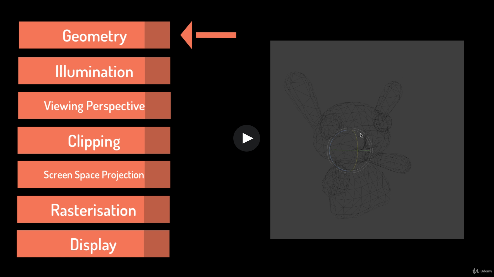
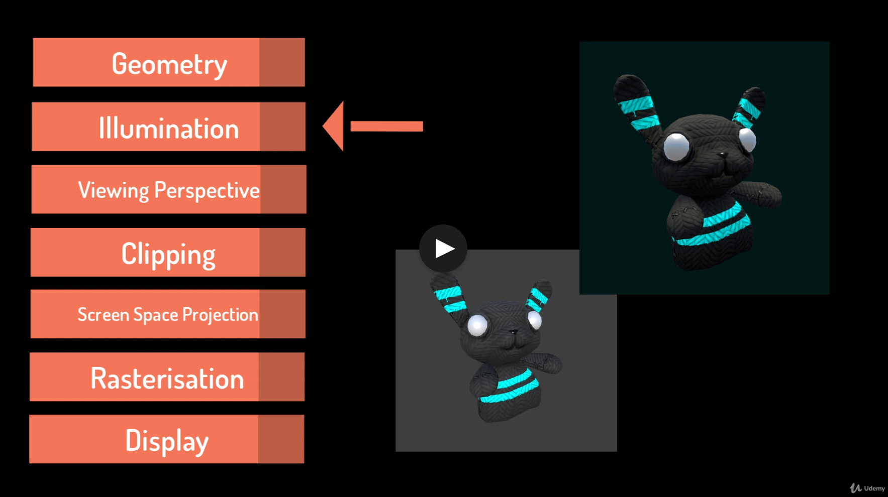
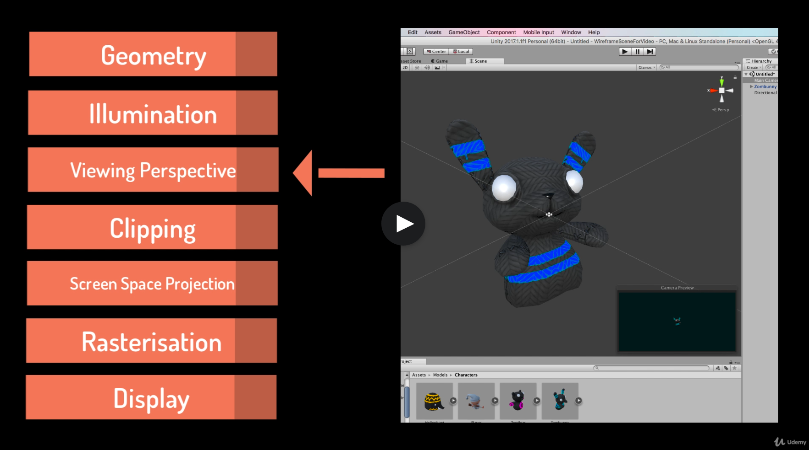
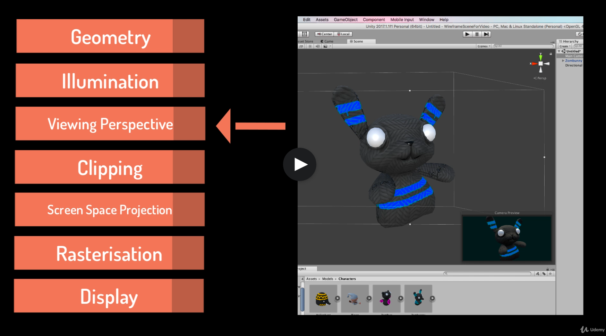
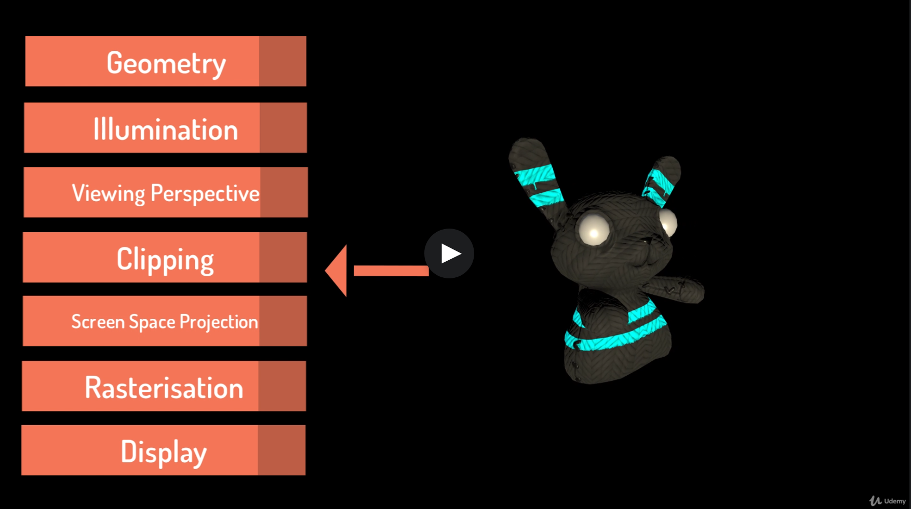
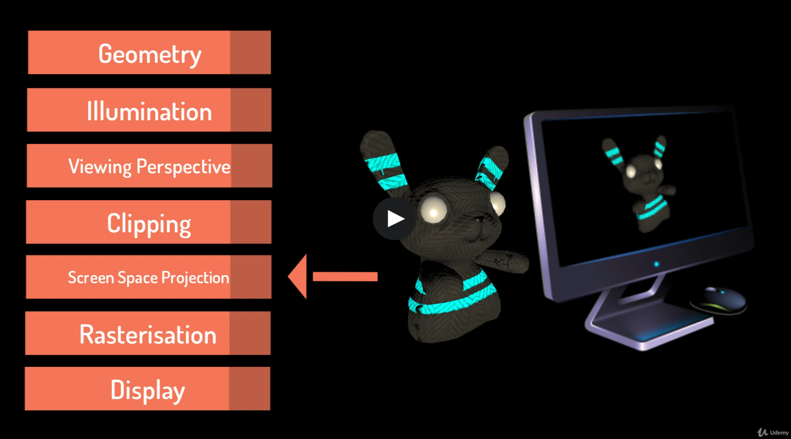
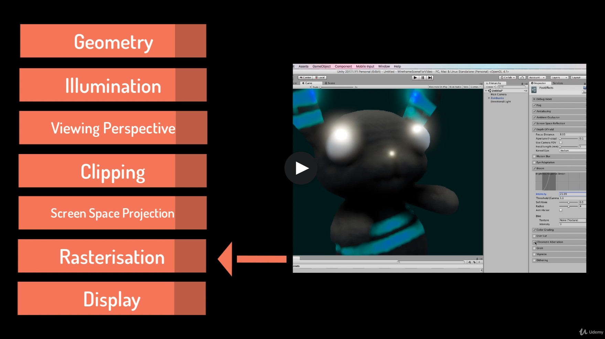

# DEV-01, The Rendering Pipeine
#### Tags: [pipeline]

## What is rendering?
    Rendering is the process of drawing a scene on the computer screen. It involves a mathematical combination
    of geometry, textures, surface treatments, the viewers perspective and lighting.

## What are the three phases to a pipeline?
    - Application
    - Geometry
    - Rasterisation

    The application phase runs on the CPU an involves all the processes that occur in the software, including mving objects, collisions,
    input etc. Its's all the behind-scene stuff that makes your project functions.

    This affects the Geometry Phase which determines how the virtual world is situated with repsect to the player. It involves calculations about the position of the camera, the rotation, transformations and scaling of the world and all the polygons.

    The Rasterisation Phase gets the world out of the computer and onto the screen.This will be the focus of this course.

## What does the Rasterisation Phase involve?
    It involves processing the environment numerous times to draw it out with different filters that are then added together to produce a final image.

## A closer look of the graphics pipline (namely the Geometry and Rasterisation processes)
    - Geometry
    - Illumination
    - Viewing Perspective
    - Clipping
    - Screen Space Projection
    - Rasterisation
    - Display

## Geometry
    First the geometry is processed and the vertices of the polygons are collected

## Illumination
    Next comes illumination, this is where the models are colored and lit. This is the specific area in the pipline we are interested in. Before the advent of Modern GPUs, the functionality of illumination was fixed. That means the developer had no control over how the model was processed. However today, through the use of modern shader languages, you can specify how the illumination stage will run and the order that these filters occur.

## Viewing Perspective
    The model is then processed through a viewing perspective that considers how the camera is set up, including whether or not it is in Percepective or Orthographic, as well as details like field of view.

## Clipping

    Anything that is outside of the camera's viewing volume is clipped

## Screen Space Projection

    A projection of the 3D object onto a 2D space

## Raterisation

    Any post-processing effects are added during the Rasterisation process. These are extra visual effects that occur to the 2D version of the image and not in the 3D space.This includes things like depth of field and bloom.

# Final

    The reason that geometric transformations and viewer perspective is so important in rendering is that the algorithms imitate lighting in the real world and examine how light is refected off the surface

    A healthy respect for vector mathematics becomes critical as you wite you own shaders.