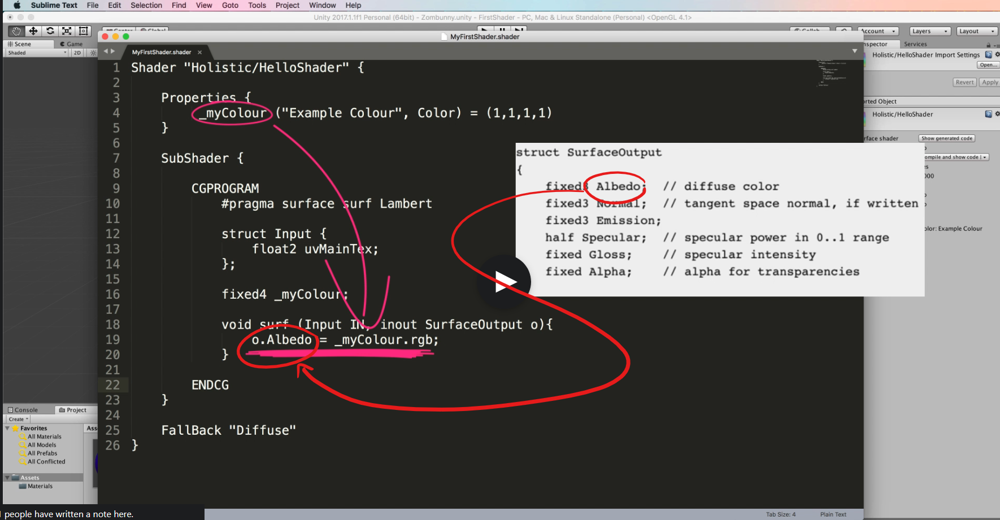

# DEV-02, Surface Shader practice
#### Tags: [shader]

## Creating a Shader Script

## Shaders
    Shaders in unity are written in a language called ShaderLab. 
    It stretches the code into logical segments to allow you to declare:
    - Properties
    - Shader processing code
    - Fallback functions (For when Graphics card might not be able to handle the code that you have written)

## Shader Name

    The very first line of code that you write gives the shader a name and tells Unity where to put it.
    Shader is called HelloShader
    ShaderSet (like a folder) is called Holistic

    You will find the drowpdowns in the material inspector

## Properties

    The properties block is where you can declare input field to use as variables in you shader processing

## SubShader

    This is where the magic takes place and you mix the inputted properties with model geometry information, surface coloring and lights to produce the final effect. We program inside here with a language called CG, also known as HLSL (High Level Shader Language). It begins with the CGPROGRAM Block

    First line beginning with #pragma is the compiler directive telling Unity how you want the code to be used.
    It contains numerous information which, in this case includes the keyword 'surface' (indicating that you are building a surface shader) 

    Then the name of the function, in this case surf

    Followed by the type of lighting you want to use, in this case Lambert

    Parameters / A struct declares the input data that will be required by your function. This can include vertex, normal, uv and other information about the model's mesh

    Then to access any properties you've created, you need to list them and the type of data they contain. You must refer to the property by name and spell it precisely. 
    Fixed4 is a special shader datatype. Its an array of 4 floats.

    Then we actually call our sharder function. It takes in the struct Input that you declared. it also specifies the output.
    The output structure changes changes depending on the lighting model used. In this case, the lighting is Lambert and therefore
    the output is the SurfaceOutput struct.

## Fallback

    Last a shader is given a fallback. This is a basic less GPU-heavy effect to use on the surface of your moodel should the machine the shader is running on is incapable of running your code.

## Code

## Result

