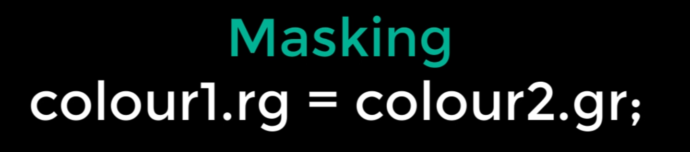

# DEV-03, Variables and Packed Arrays
#### Tags: [Datatypes]

## Shader Code

    When we are writing HLSL wh are not technically writing all the code in the graphics pipeline. 
    We are writing just enough code to compile into a shader.

    Shader code is executed on a per-vertex or per-pixel basis
    That means the code you write, you write as though you are only writign for one pixel.
    No need for loops that process all the the pixels or so. Thats handled by the GPU.

## Basic Data Types

    Key differences Between C# and HLSL are the variables and arrays. The additional datatypes have been designed to be more efficient.

    - float
    - half
    - fixed
    - int

## Texture Data Types
    
    As many shaders work with textures, it makes sense for them to have their own data type.

    - sampler2D
    - samplerCUBE

    Each of these has a high and low precision version, for low-end image processing and high-end manipulation.

    - sampler2D_half
    - samplerCUBE_half

    - sampler2D_float
    - samplerCUBE_float

## Packed Arrays

    Any of these data types can be made into special arrays used in hlsl called packed arrays

    These are some data types

    Here are how they would be used

    For example if you wanted to set the first value in a packed array, you would use x or r

    colour1.r = 1;
    colour2.x = 1;

    This is the essentially the same operation twice

## Swizzle

    This allows you to reorder the indices to put the array values in a different order.

## Smearing

    This is the process of filling all positions in the array with the same values, using a single value.

## Masking

    Finally you can use Masking when dealing with packed arrays to copy over as many values as you like from one array to another, in any order.

## Packed Matrices

    Many calculations in computer graphics require data structures bigger than arrays therefore use matrices. Information for world geometry states, transformations, rotations and scales are performed by matrices. 

    To cater for this, shaders have another data structure called a Packed Matrix. A packed matrix is declared using the datatype
    float, fixed etc. followed by the 'number of rows' multiplied by 'the number of columns'. 

## Chaining

    A syntax called Chaining allows you to specify a list of values from a matrix to go to an array

