# DEV-04, The Anatomy of a Mesh and Shader Input
#### Tags: [shaders]

## Anatomy run down

    A cube is a mesh made of six sides where each side is constructed from two triangles.
    The most efficient way to strore a mesh is by using triangles and therefore you will find most models constructed from them.

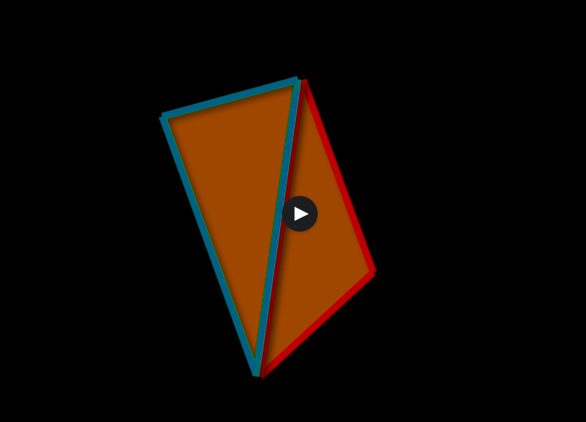

    A triangle has three vertiece, one in each corner, with a coordinate representing its location in 3D space, a flat surface connecting the vertices and a surface normal.

    A normal vector is a vector extending from the point of orgin at 90 degrees to the surface.

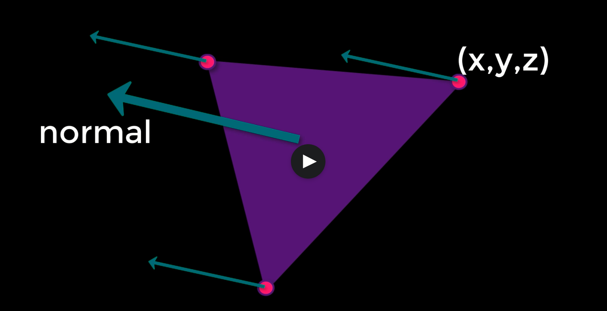

    Normals are especially important in computer graphics as they indicate the side of the polygon that the texture should be applied to.
    They are also used in calculating how an object is shaded by determining how light hits the surface.

## What is a mesh?

    A Mesh is stored as a series of arrays that store all the information about vertices and normals. They include:
    A Vertex array holding each corner's 3D coordinates, 
    A Normal array with each of the vertices normals,
    An UV array that specifies how a texture is wrapped onto a model
    A Triangle array of each individual polygon.

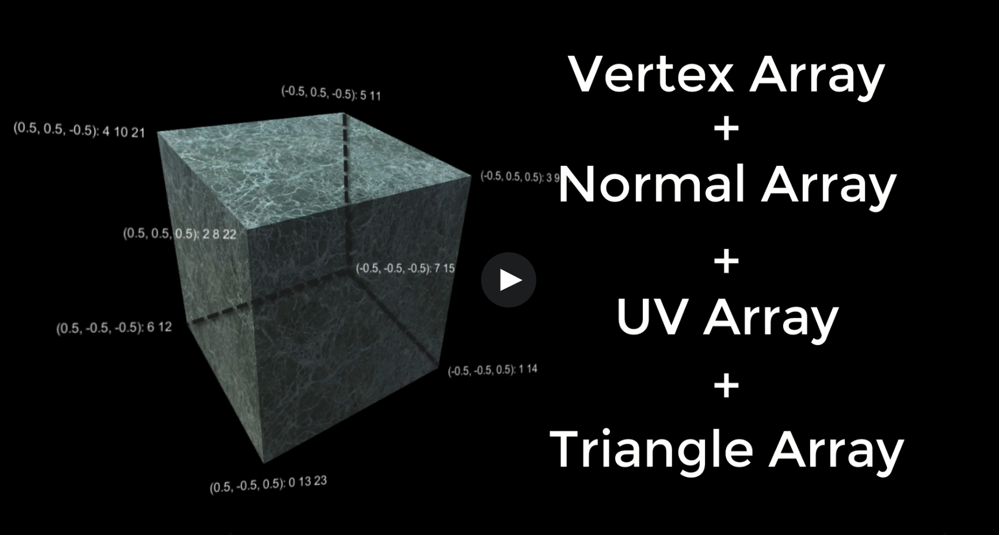

    The coordinates of every vertex are listed in the Vertex array, For Each of these vertices, a normal is also recorded in the Normal Array

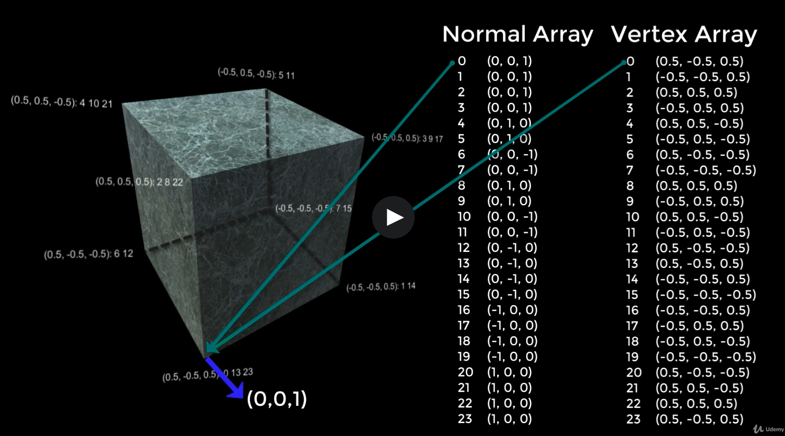

    The UV array indicates how different parts of a 2D texture are mapped to each 3D vertex.
    The UVs are specified in 2D space

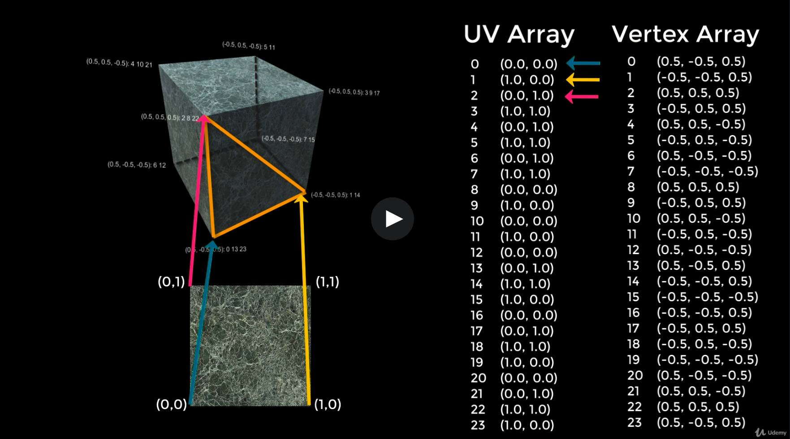

    Triangles array list vertieces in groups of three, where each tuple represents a single triangle, making up the surface of the mesh

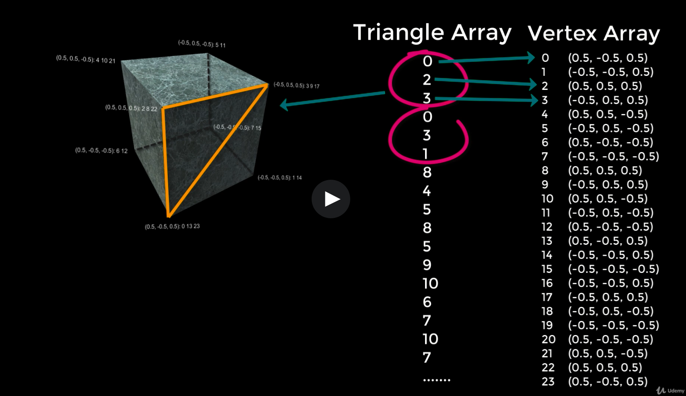

## Understanding how UVs work
    
    Understanding how UVs work is also critical to working with computer graphics.
    UVs represent a point on a texture that is mapped to a point on a polygon.

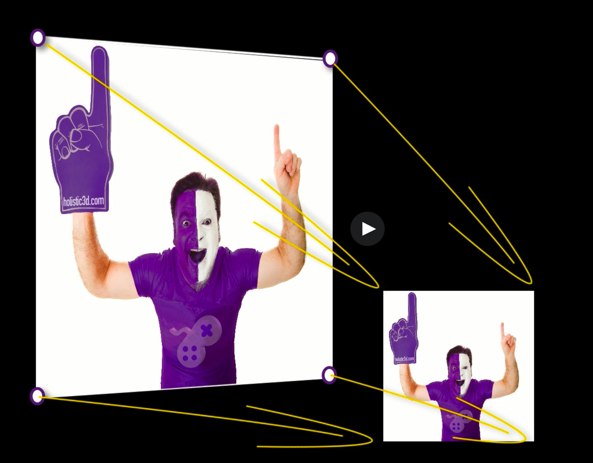

    Whereas a vertex is represented by an x,y and z value in 3D space, 
    a UV is represented by the letters u, v and w. The 'w' is only used
    internally for calculations which leaves the UV as a 2D value and also gives the UV its name.

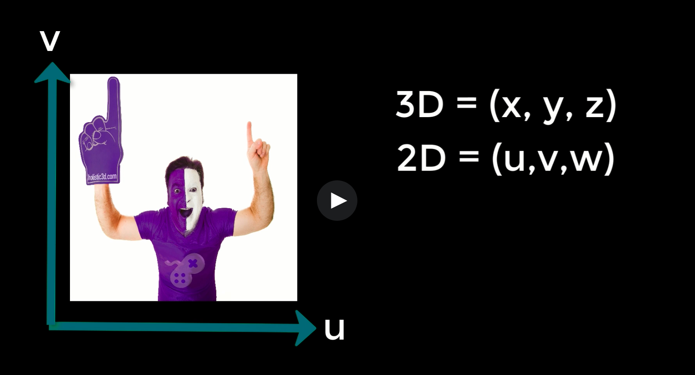

    UV values fall between 0 and 1, no matter how big the texture.
    Think of it like a percentage rather than an exact location.

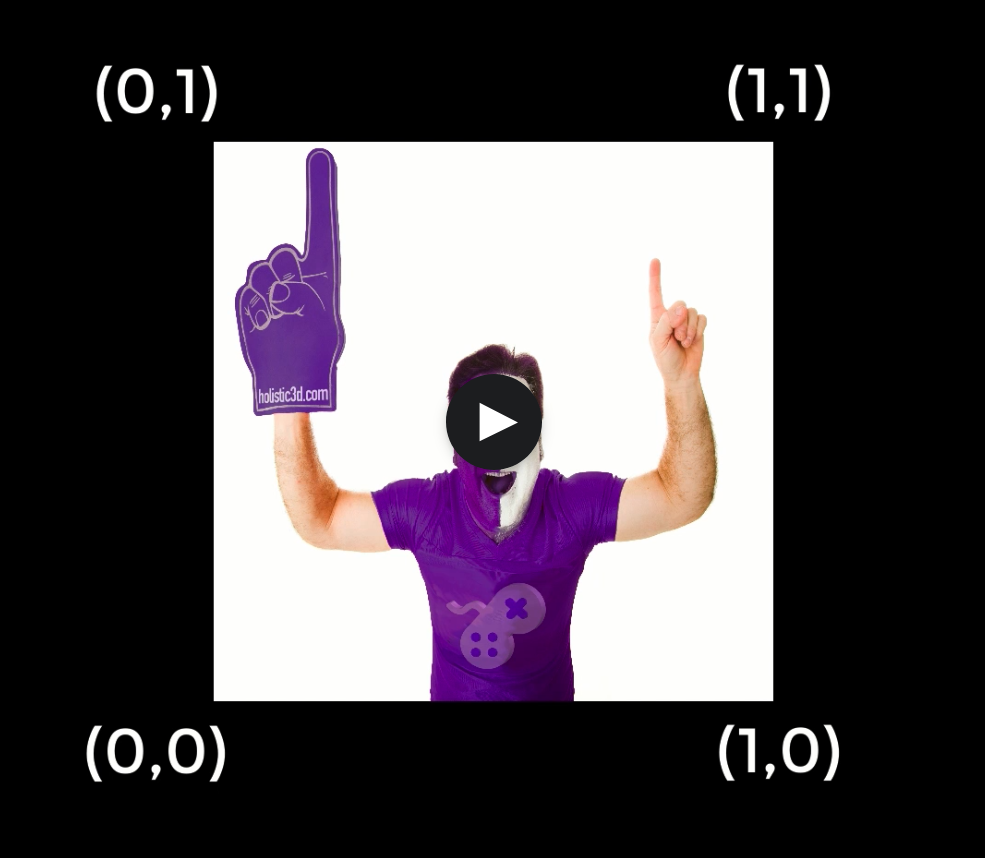

    UVs belong to each vertex and are always ordered in anti-clockwise order
    on the face in which the normal faces the viewer.

    Meshes can have more than one UV

## Creating a Quad from scratch 

https://github.com/MuteBard/Unity_Voxel/blob/main/Projects/PROJ-01/Voxel/Assets/Scripts/Quad.cs

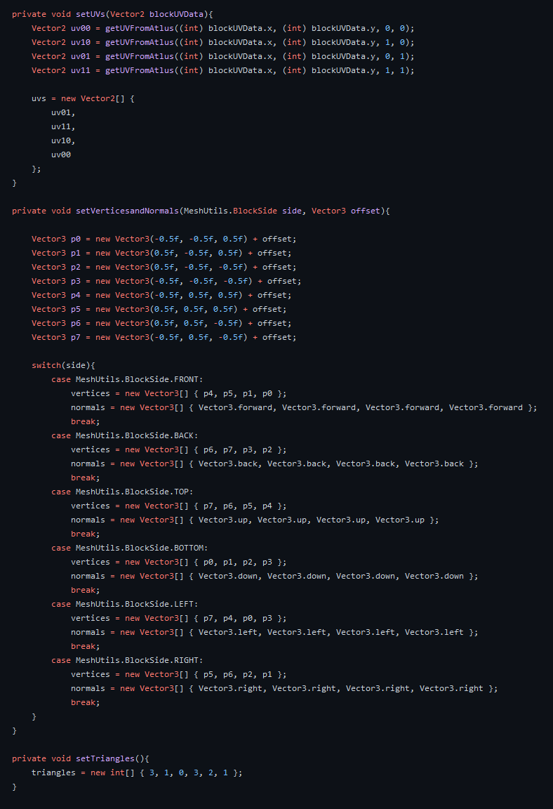

## UVs in ShaderGraph

    The input struct in the shader code is where you declare any values from the mesh that you will need to manipulate in the shader function.

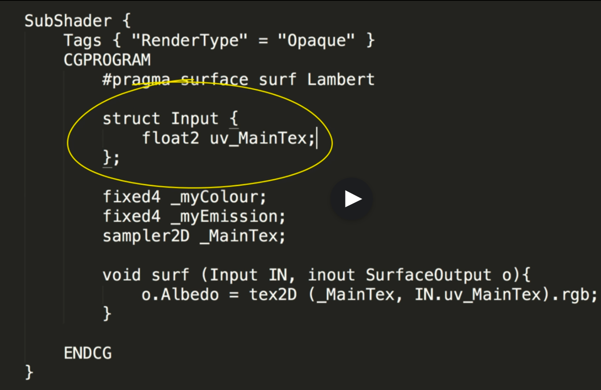

    Even though you there are times we dont use it, it is required as Input by the surface shader function

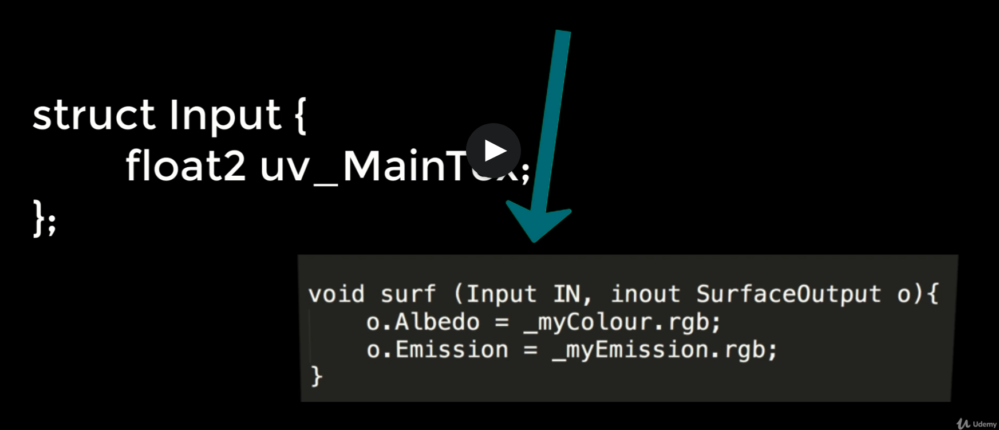

    When we start manipulating the meshData via the input structure, you can create all sorts of exciting visuals

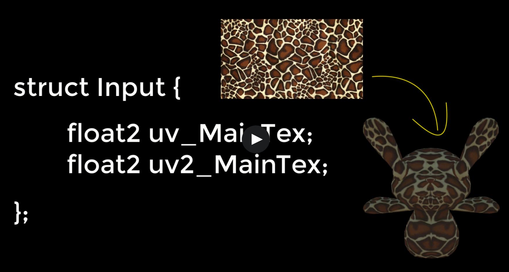
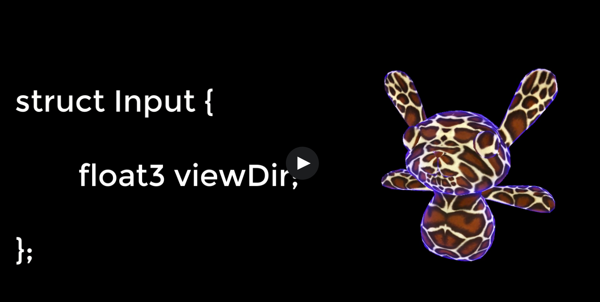
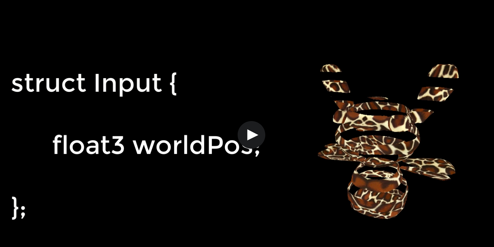

    WorldRefl;

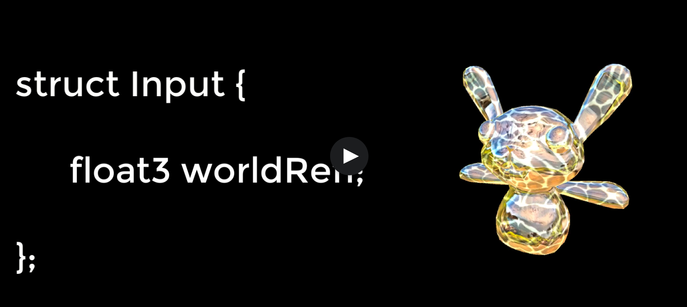

    The important takeaway is that the 3D mesh has many values that are required to manipulate how a material will visually present on a surface and it's the job of the input struct to get these values to your shader function.

