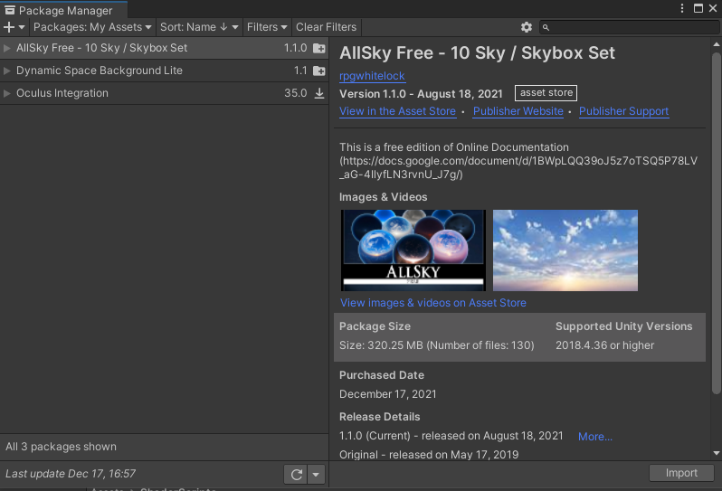
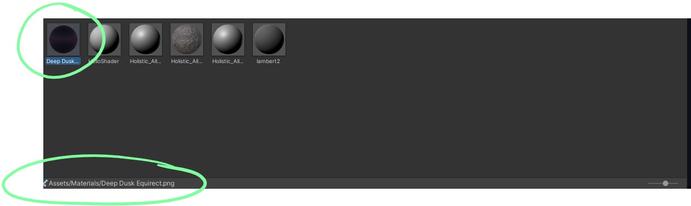
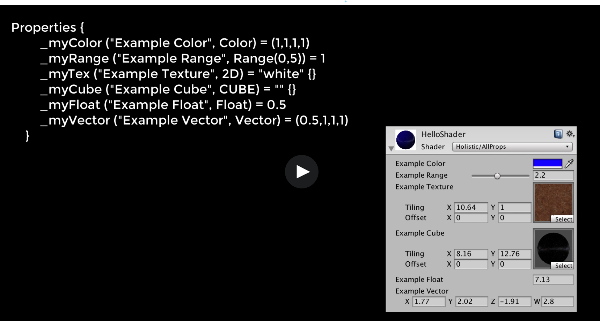
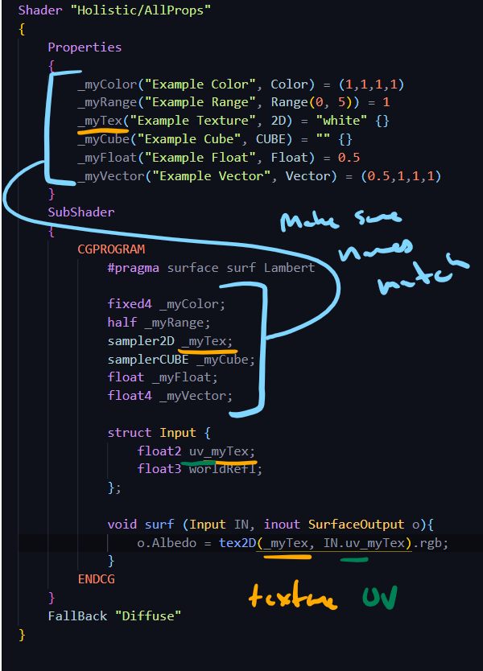
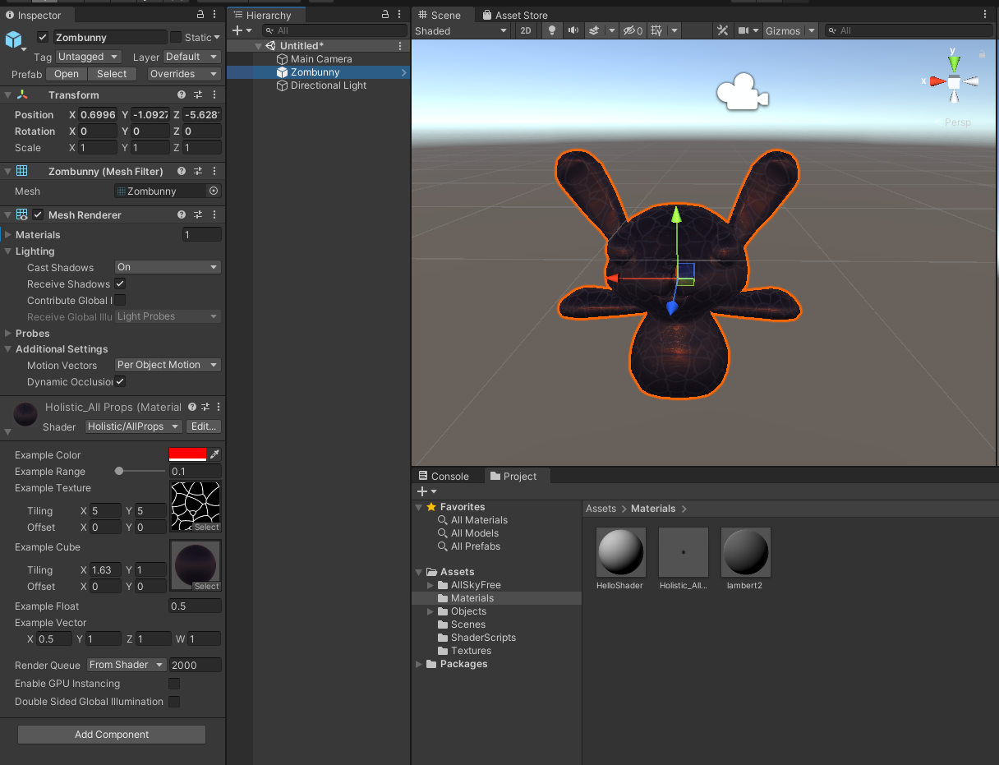
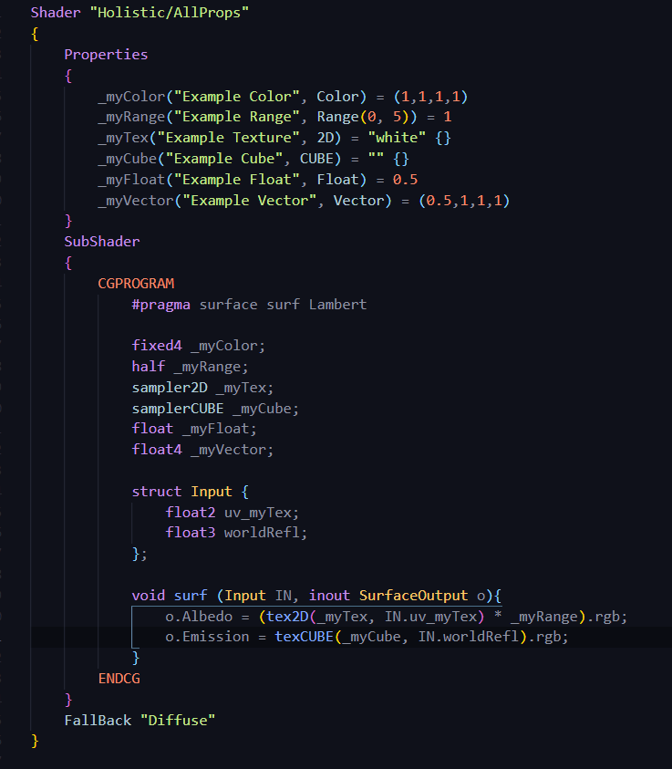

# DEV-05, Shader Properties
#### Tags: [Shader Properties]

## Grab this Asset to get a skybox

    https://assetstore.unity.com/packages/2d/textures-materials/sky/allsky-free-10-sky-skybox-set-146014

## Be sure to then import it

    This will serve as our "Example Cube"

## Properties

    Properties are the way we get values from the inspector into the shader. 

    Notice that there is not semicolons in the properties block

## Results

