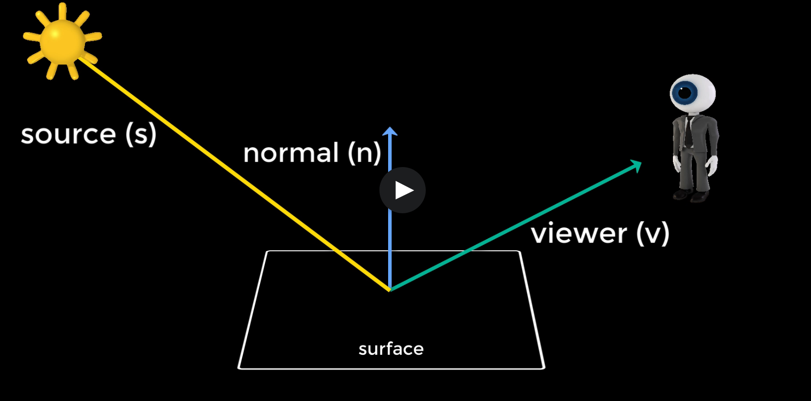
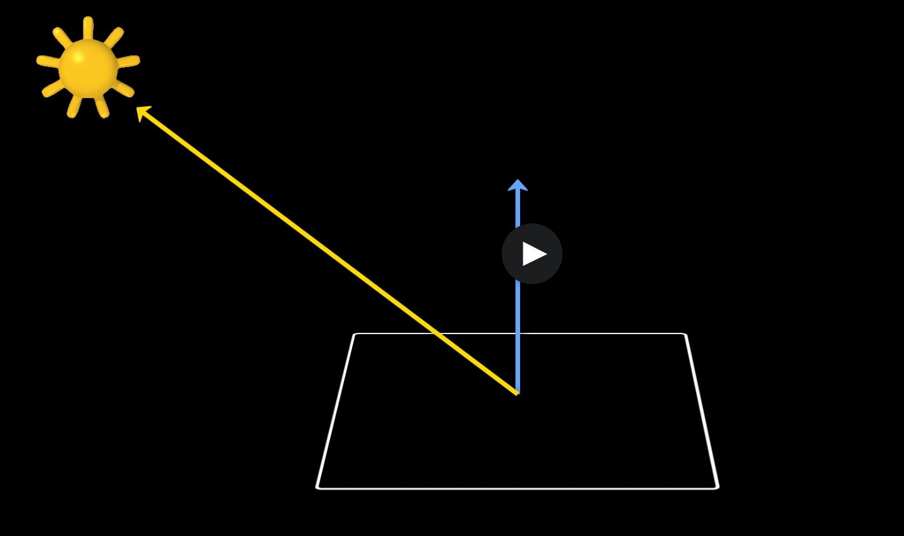
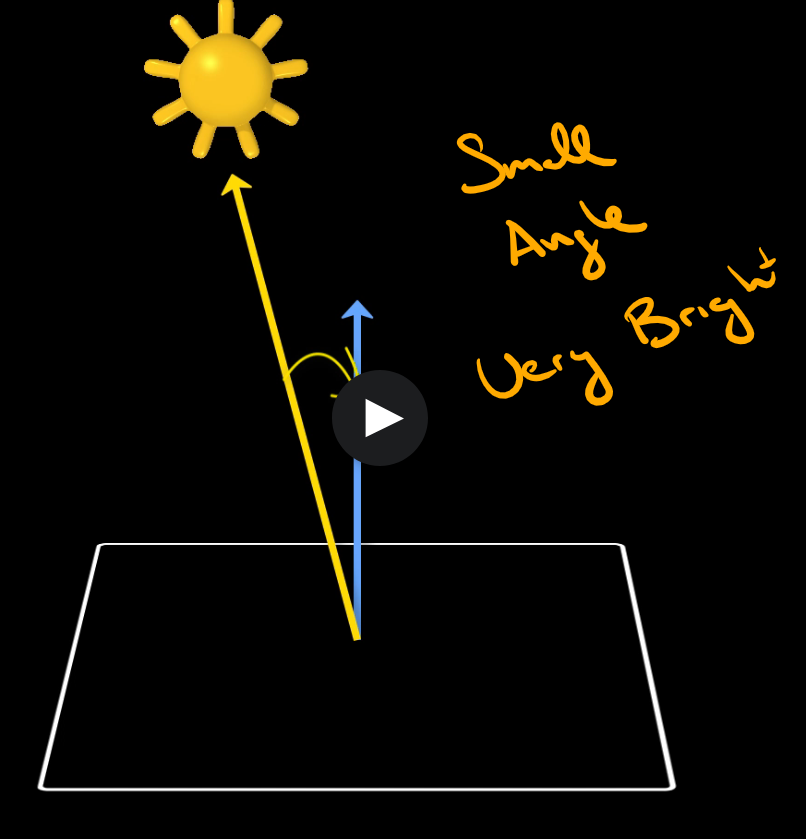
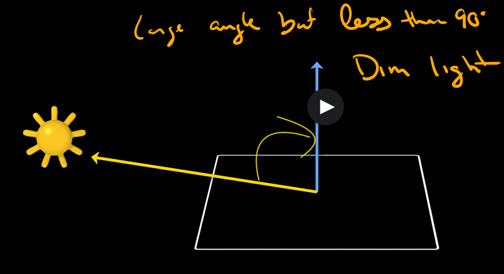
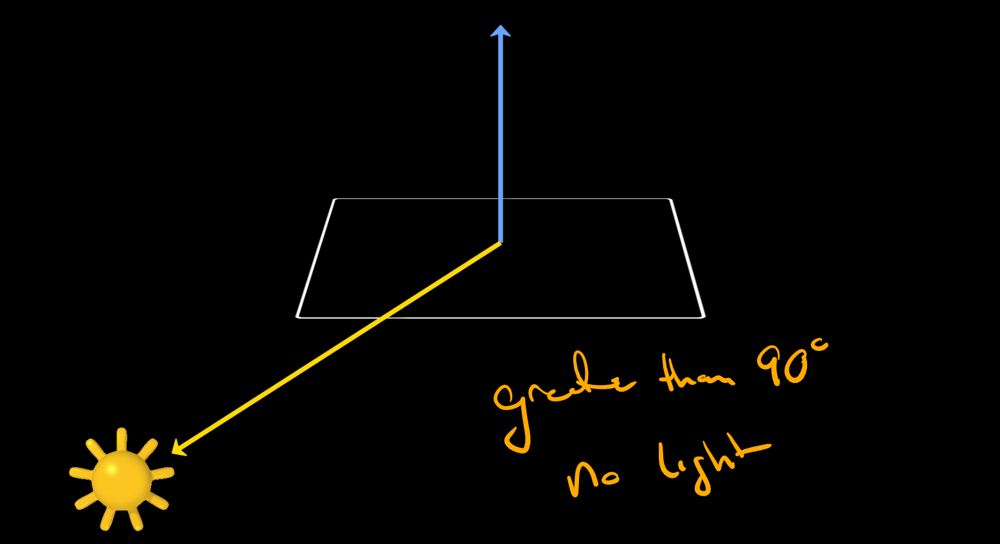

# DEV-06, Lambert & Lighting
#### Tags: [Lighting]

## Lambert
    So far we've been using a lighting model called Lambert, with very little discussion about what it's doing.
    But before we can go any further in developing more complex shaders, it's crucial to your understanding
    to have a look at what Lambert is and how Lambert works. 

    A lighting model is used to calculate the amount of reflected light from a surface

    it considers three things:
    - the normal vector
    - vector to the viewer of the surface
    - the vector to the light source
    - (sometimes the orgin point of all three)

    Lighting in computer graphics is all about calculating the intensity and color of the light reaching the viewer.
    This involves computing the angles between these vectors.

## So What is Lambert?

    Lambert is a lighting model that defines the relationship between the brightness of a surface and its orientation to the light source. Lambert is the simplest lighting model as it only considers one angle, That between the source and the normal.

