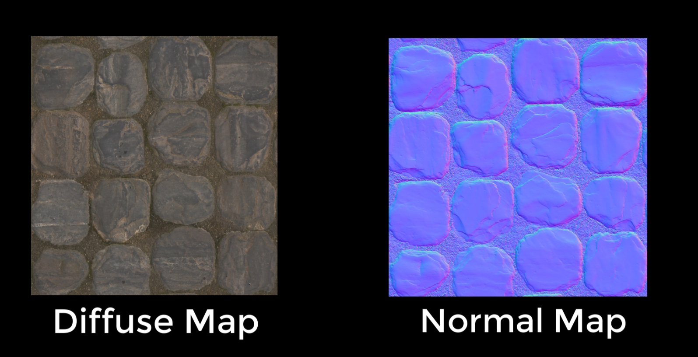

# DEV-07, Normal Mapping
#### Tags: [normal mapping, bump mapping]

## What will this be about?
     We'll examine how to modify this normal re mentioned from DEV-06 to generate a raised texture on a flat surface. This technique
     is called Normal Mapping.

## Recap on Lambert

    We know that Lambert lighting is going to give a flat-looking surface, with the same brightness over the entire
    surface because for that surface the angle between the normal and the source influences calculation.

    But what if you could determine a whole bunch of normals across the surface and then manipulate them.
    This is the job of a normal map.

    Instead of having one normal on a flat surface, a normal map produces one for each pixel, but it doesn't just make more normals,
    it changes their direction.

    It's important to note that these new normals are only for visual effects. They don't actually modify the geometry of the mesh.

## Diffuse Map
    What we have been using so far, its a texture that surve to only add color to the mesh.
    Lambert lighting treats it as a flat and light it evently across the surface.

## Normal Map
    The normal map is used for manipulating the normals used for the lighting calculations. They are really strange and can be distiguished by their bluish color

## How do Normal Maps work?

    Each pixel in a normal map is stored as an RGB color value.

    The RGB values are converted to X,Y and Z values that represent a vector. This vector becomes a normal at that pixel location. The X(Red) and Y (Green) values, lie vertically and horizontally across while the Z (Blue) dictate how much it protrudes.

    As you can see, the less blue in a pixel, the flatter the normal, which means that
    fully blue areas represent bright areas, areas facing towards the viewer and others away, making them
    duller and giving them the illusion of shadows. All this allows us to add visual bumps to the surface of a model,
    where none actually exist.

## Bump Mapping

    Bump mapping produces great depth results on the cheap, but it is limited as it only creates visual effects
    and not a geometric one. It will fall down under close scrutiny.

    For example the sphere on the left is bumped mapped, while the one on the right is actual geometry.
    Take a close look at the silhouette. You can see the bump-mapped sphere isn't bumpy at all. It is still
    geometrically smooth.
    Having said this, bump mapping is the perfect way to get detail and depth into a model for very little
    cost to processing, especially if you were to consider adding a model with the exact bumpy geometry.

## 3D Scans website to find textures

https://www.textures.com/browse/3d-scans/114548

## Applying the texture

## Manipulating the reds and greens of the normal map to simulate depth

Video

#

ShaderGraph File

#

CSharp File

