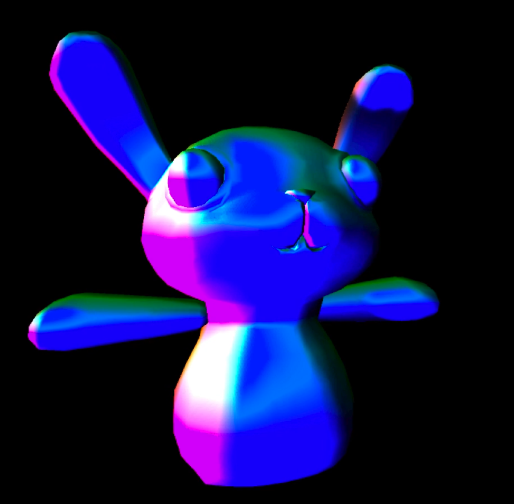

# DEV-08, Illumination Models
#### Tags: [Illumination Models]

## Why do I care about Illumination Models

    The normals across the surface of each polygon are being calculated on a per-pixel basis
    rather than using the geometric normals at each vertex. How the normal data from a model is dealt with
    depends on the Illumination Model.

## There are Three Illumination Models
    - Flat
    - Gouraud
    - Phong

## What is Flat Shading

    Flat shading, The simplest and least computationally heavy model as it uses a single normal
    (usually the one that comes with the mesh) to shade each polygon. That gives the entire surface of a polygon
    the same color and makes it appear flat.

## What is Gouraud Shading

    In Gouraud shading, the color of pixels across the surface of
    a polygon are determined through interpolation of the colors at each vertex.
    This results in a blended shading effect across each polygon. Gouraud shading works ok until you add highly
    localized light. If a light is focused on a single polygon,
    its values are not transferred to neighboring polygons.

## What is Phong Shading

    In Phong shading, the flat surface is made to appear curved by modifying the normals on a
    per-pixel basis across the polygon. Taking the actual normals at each vertex, the ones across the surface
    are calculated as an interpolation of one to another.
    This results in a blended shading across each polygon. Phong shading (and versions thereof)
    are used today to provide a much smoother appearance and are used by Unity by default. 

