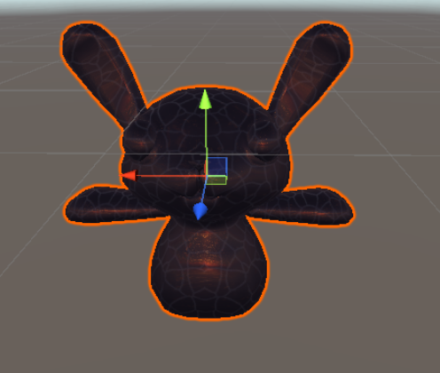
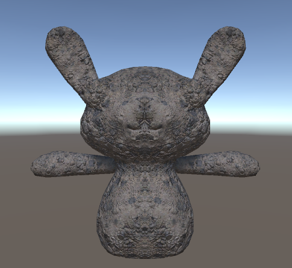
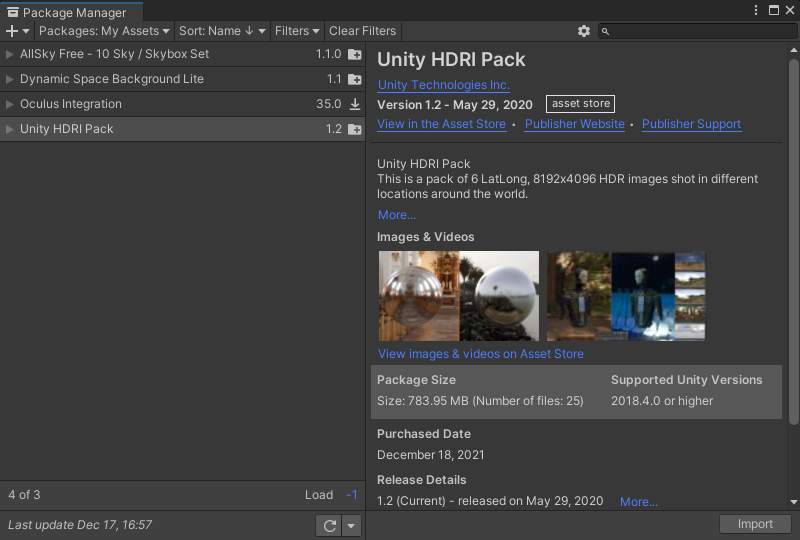
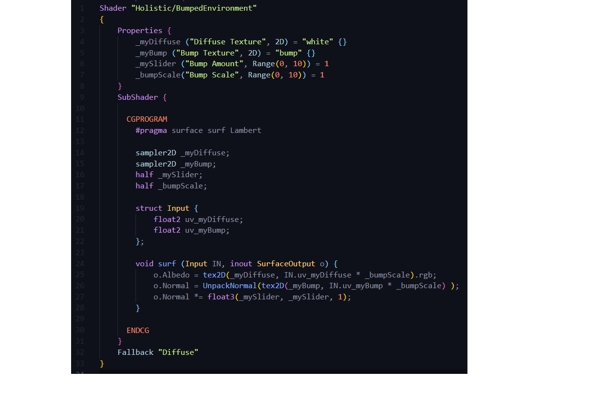
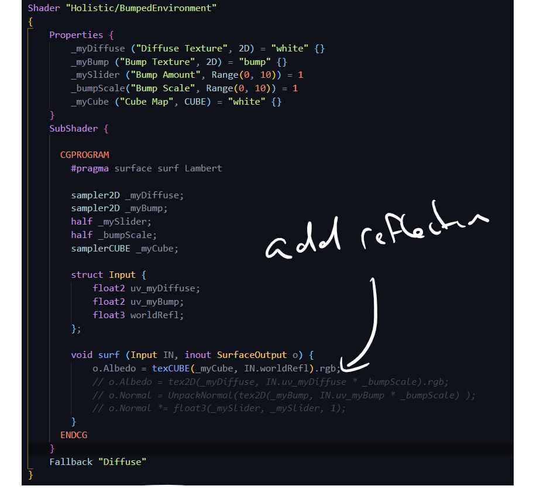
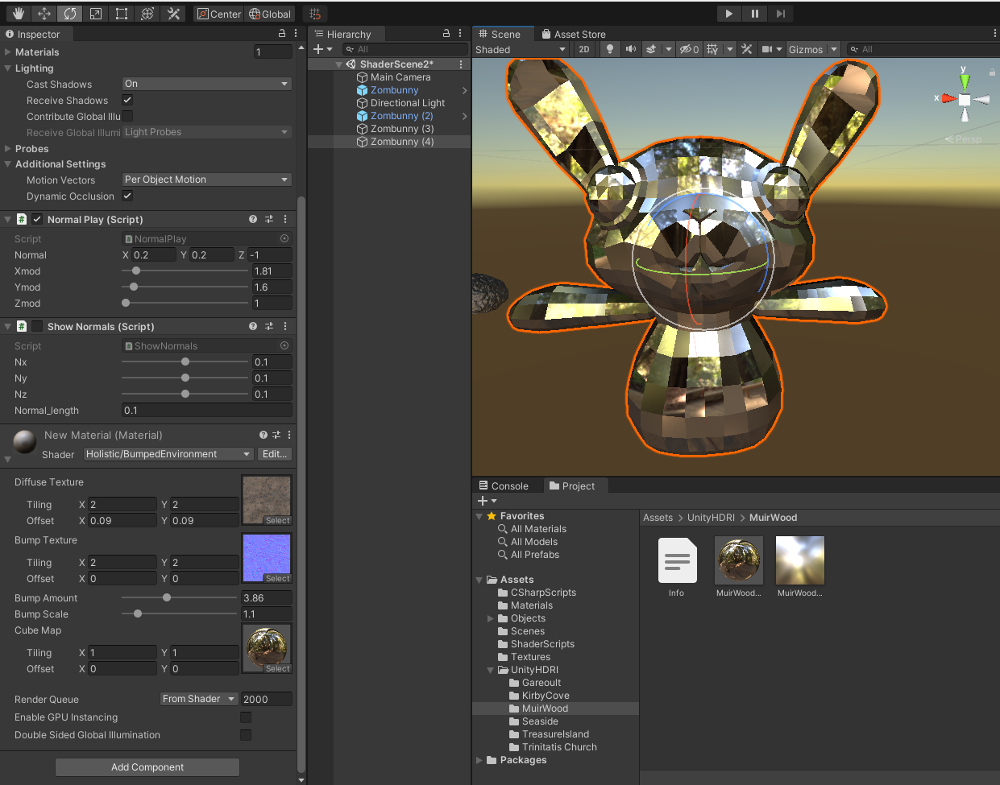
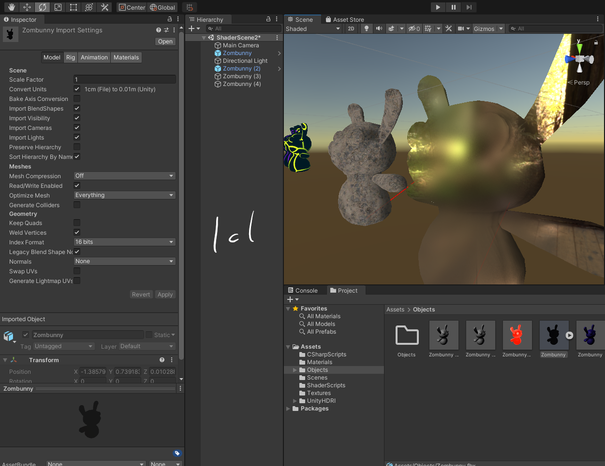
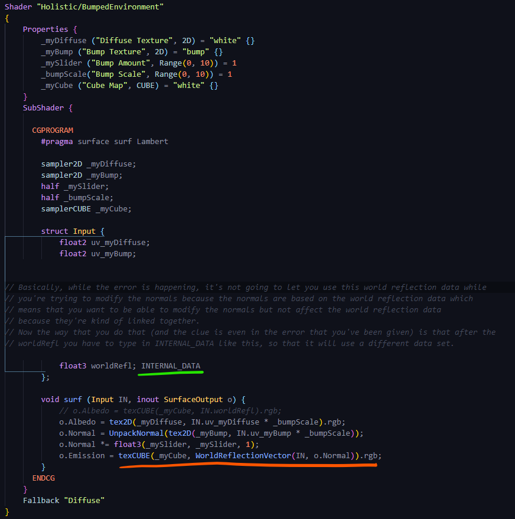
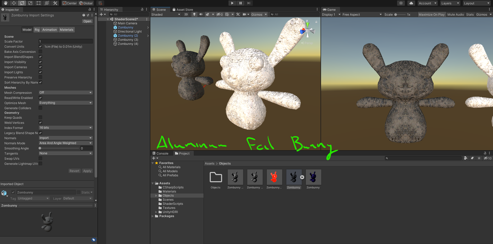
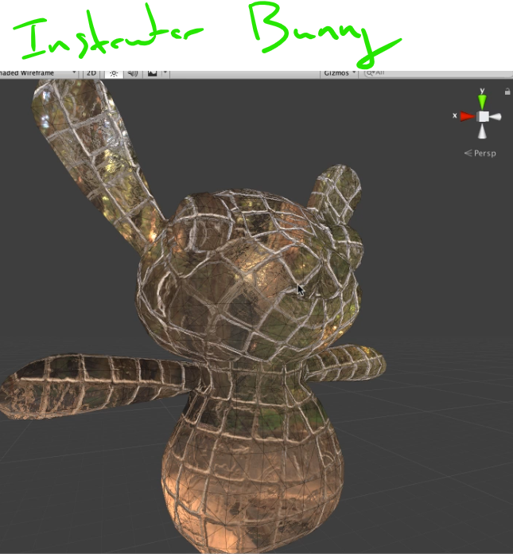

# DEV-09, Bumped Environments
#### Tags: [Bumped Environments]

## What are I trying to do?

    We are trying to incorporate environment reflection. We want the bunny to reflect its environment. 
    Back in DEV-05 I did just that, I imported a cube map and had the bunny reflect its while the is was smooth with no normal/bump mapping.

    How that worked is that I took a vector out towards a cube map from ther bunny and then took those points on the cube map and matched them back on to the bunny, as the texture of the bunny.

    We're going to do the same thing now, but imagine instead of having a smooth bunny, you've got a bunny
    like this that's actually made up of all these little tiles and these ridges in here. You can't do a smooth
    reflection back onto this bunny because obviously if you think about the way light would hit and reflect
    off of this, it's going to react differently where all the little cracks and everything
    are.

## New CubeMaps

https://assetstore.unity.com/packages/2d/textures-materials/sky/unity-hdri-pack-72511

## Starting Shader Script

    Our goal is to create a script that takes these ridges into account while reflecting the Example Cube

    If you try to do the line in RED alone, you will get an error. You will need to supply the line in GREEN so that you tell unity to use internal calculations

