# DEV-11, The Dot Product
#### Tags: [Dot Product]

## Why

    This operation will allow us more power over the manipulation of of vectors.

## The Dot product

    The dot product of two vectors, A and B is written

    a.b

    and can be calculated in two ways

    The first multiplies the length of each vector together with the cosine of the angle between them.

    The second multiplies each individual coordinate of one vector with the other and then adds them all

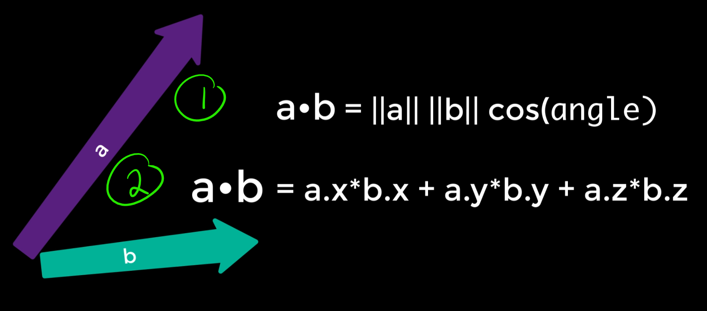

    In ShaderLab, how to compute it looks like this:

    half dotp = dot(IN.viewDir, o.Normal);

## Again Why do I care?

    Imagine you want to color pixels differently on certain parts of an object.
    The dot product is a key factor in producing effects such as rim lighting, outlining and anisotropic highlights. 
    
## Some effects

    rim lighting

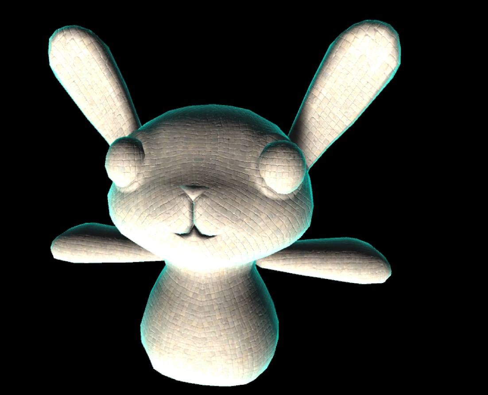

    outlining

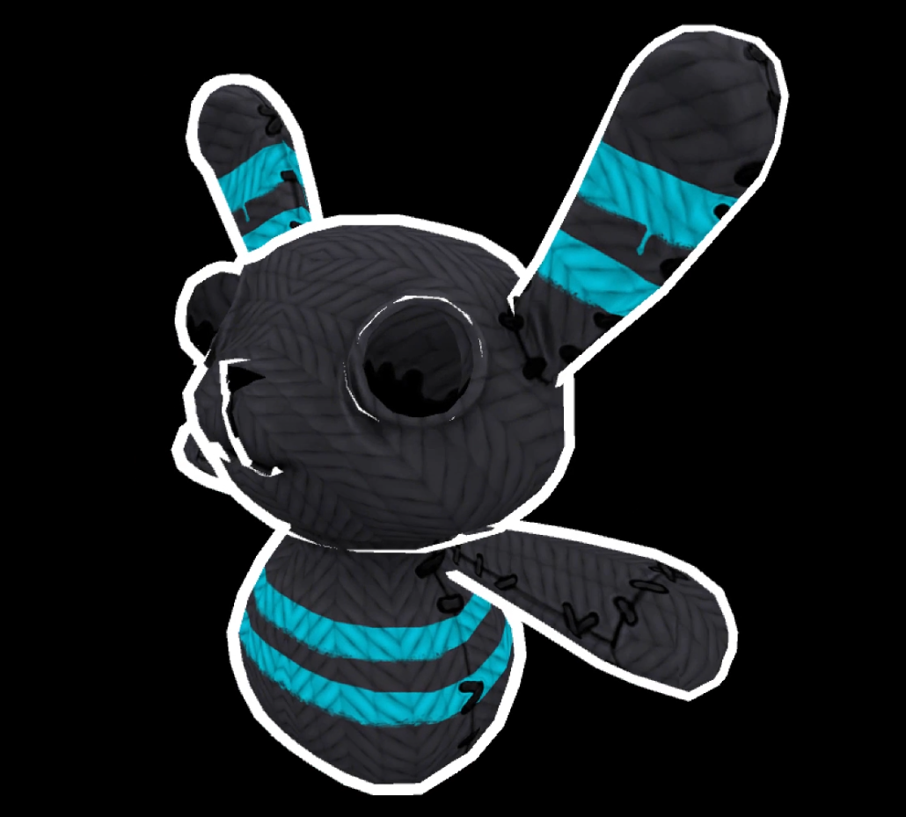

    anisotropic

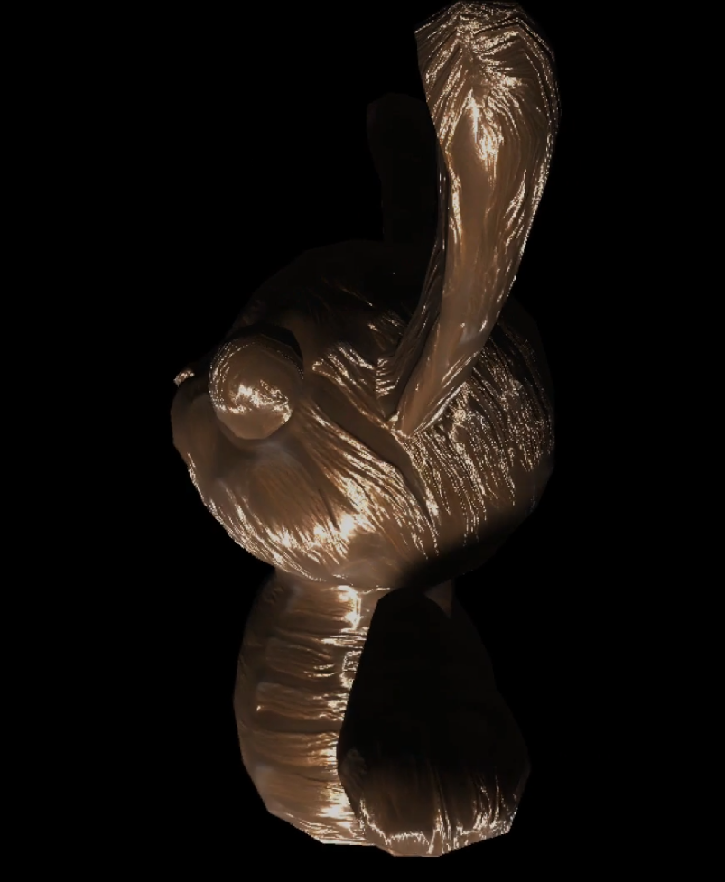

## Diving deeper into the Dot product

    The dot product tells us if two vectors are pointing in the same direction, pointing int he opposite directions, are at 90 degrees or somewhere in between.
    When two vectors are normalized to their unit length of 1

    same

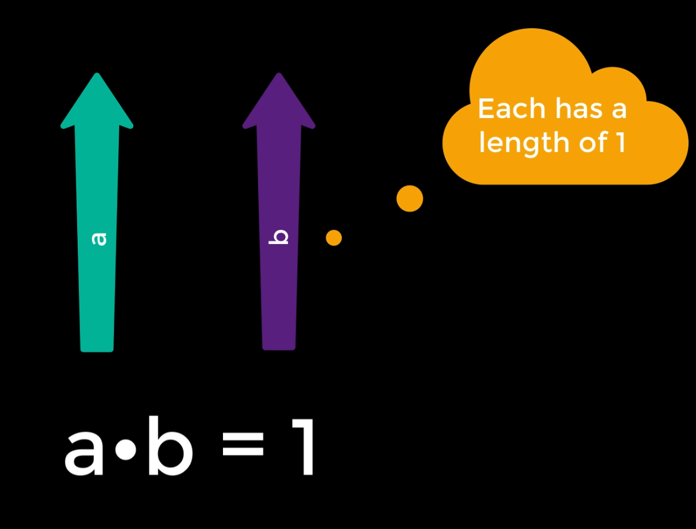

    opposite

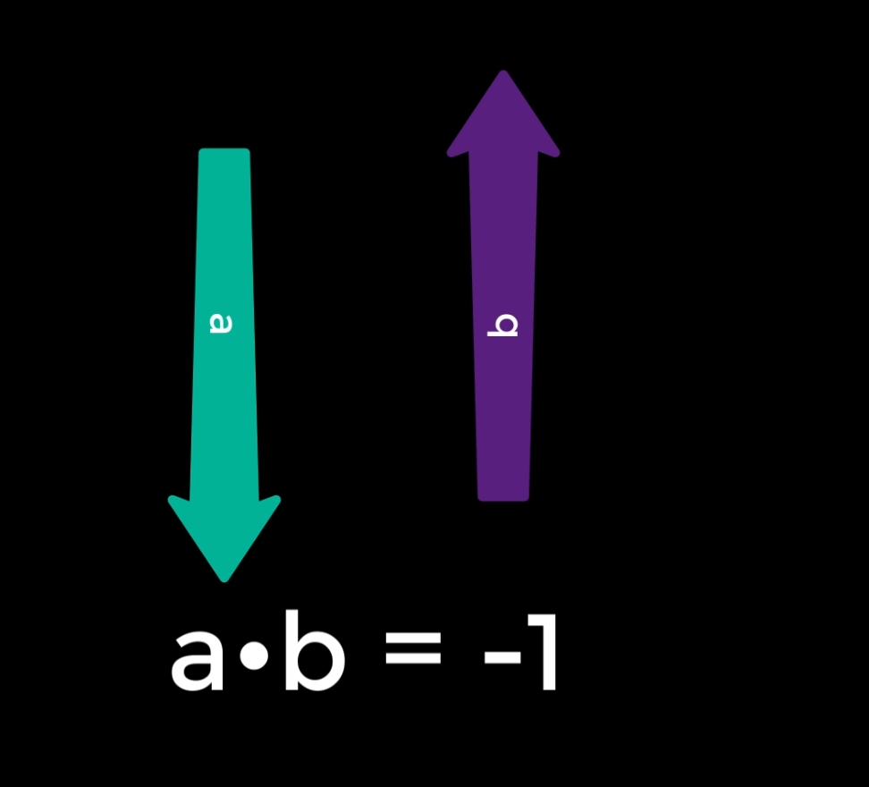

    perpendicular

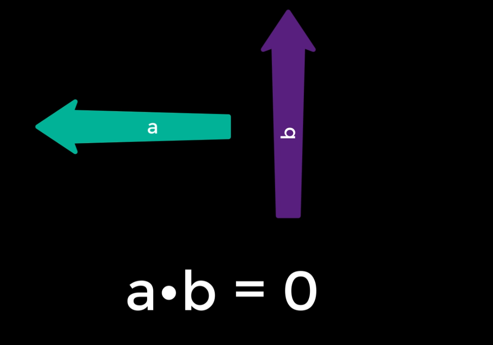

    If one of those vectors represents the normal on a polygon, then you can also deduce the side of the polygon the other vector is on

    For a positive dot product, the vector is on the same side.

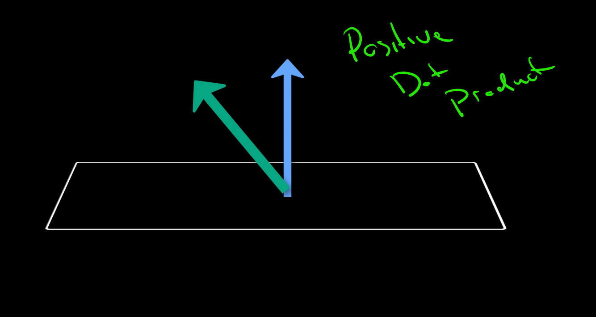

    For a negative dot product, the vector is on the underside

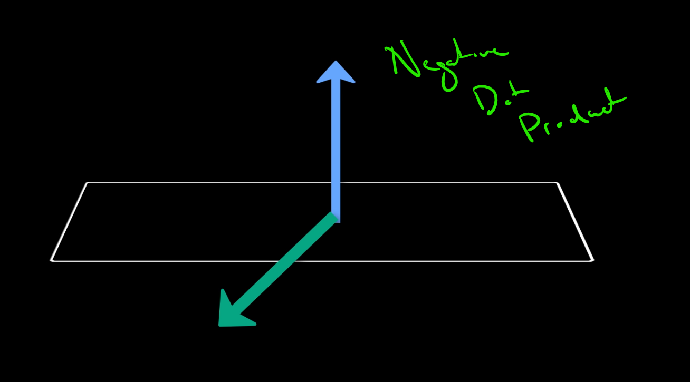

    For a dot product of 0, it is lying on the surface.

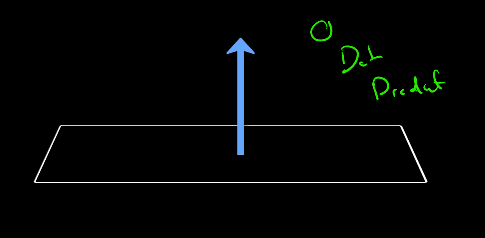

## WHat does this mean for me?

    We can build custom shaders based on the direction of the viewer relative to an object.
    The viewer is always perceiving the virtual environment from their position behind the computer screen, hence thats where the viewer direction comes from.
    You'll see this written as the viewDir in the shader input structure. 

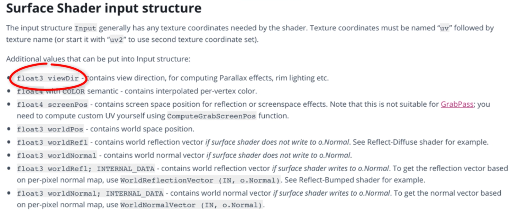

     Given the view direction and all the normals on the model, I can use a dot product to determine which sides of the mesh are facing toward the viewer and those that are facing away. But not only that, I can also tell how MUCH they are facing the viewer.

     Any normals that make a dot product with the view vector close to 1 will represent faces of the model that face (or sit quite perpendicular to) the viewer.

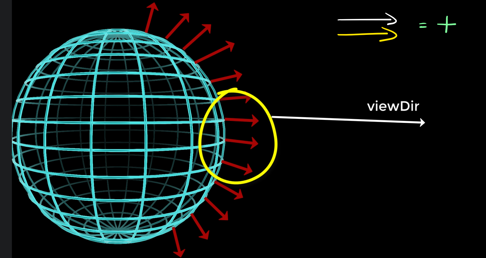

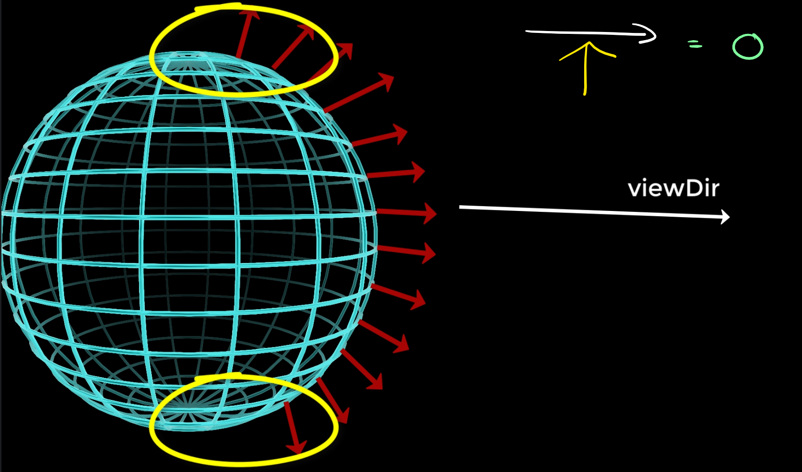

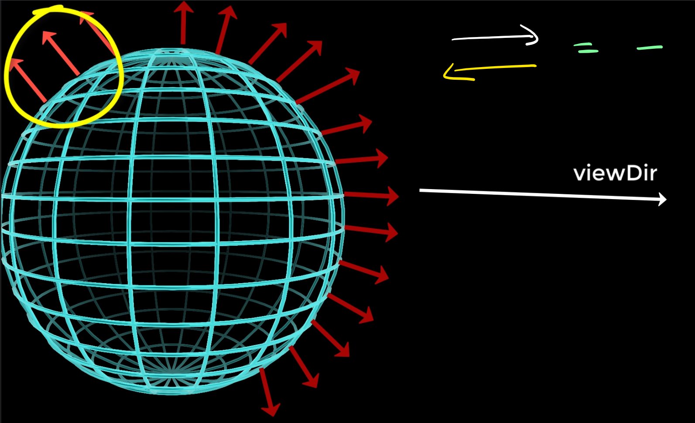
