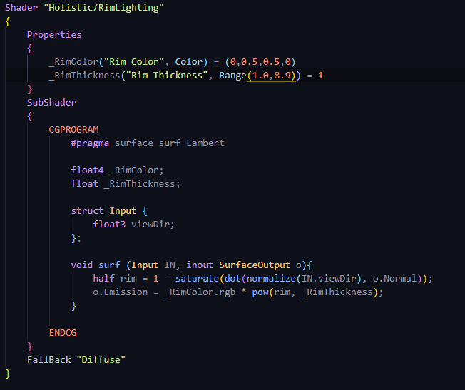

# DEV-12, Rim Lighting
#### Tags: [Rim lighting]

## What is Rim Lighting?
    Rim Lighting or shading is coloring around the edges of a model respective to the viewers location.
    You often see the effect used to color the atmosphere of planets and the outlines of holograms.

    What normalize does is it reduces the direction down to a length of 1, that still faces in the same
    direction, but it's just a little bit smaller. When you do a dot product of both vectors being a length of 1,
    then you get very clean values between 1 and -1.

    But if you're ever working with ANY vector and you want to make sure that the dot product does give
    you a value between 1 and -1, you will have to ensure that both of these vectors in here are normalized.

    dot(normalize(IN.viewDir, o.Normal));

## Step 1

    So rather than have the brightest (or most colorful) part right where I're looking at it, I want it to
    be on the edges. So I need to reverse it with 1-.

# Step 2

    As far as a color is concerned,
    multiplying it by -1 is kind of worthless. 1 is having that color full on
    at that particular color and having it at 0 is having none of that color.
    Having a -1 isn't really doing anything for us.
    So rather than have the dot between -1 and 1, I want to move it so that it's between 0 and 1
    and to do that I use a function called 'saturate'.

# Step 3

    To figure out how to modify the dot product to compress
    values into one part of a model and not another,
    I need to turn to mathematics.

    We can achive this by using a power function

## Result

