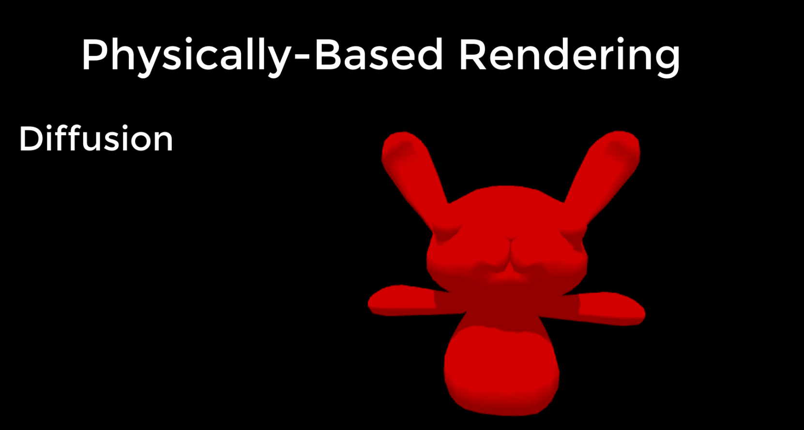

# DEV-14, Lighting Models
#### Tags: [Lighting]

## Light models revisited

    Lambert is not very good at generating reflections and highlights from light sources (not from environments).

    Phong considers the viewers location, as well as how light reflects from a surface. Phong includes the calculation of specular reflection or how light
    bounces off a surface. A reflection will be at its strongest when the outgoing angle is equal to the incoming angle. On either side of the outgoing angle, the reflection is said to 'fall off'.

    How much it falls off depends on the quality of the surface, where shinier object have a quicker fall off. The amount of reflection the viewer sees will depend on the angle between the reflection vector and the vector to the viewer. With a slow falloff, the reflection loses strength gradually away from the reflection vector and spreads the shine out

    An improvement in the Phong calculations was made by James Blinn.
    Yes, the same guy who invented Bump Mapping. He introduced to Phong an additional vector called The Halfway Vector.

    This vector sits halfway between the source and the viewer.
    The Blinn/Phong model is an improvement on Phong as it reduces the need to calculate the reflection vector

    The angle between the halfway and the normal is used to work out the intensity. In short, Blinn/Phong is a far more efficient specular reflection model than Phong alone.

## Physically Based Rendering lighting model

    While all the versions of Unity employ both Lambert and Blinn/Phong, since Unity 5 developers have had access to the Standard and Standard Specular shaders that follow a Physically Based Rendering lighting model.

    The goal with PBR is ultimately photorealism. As you can imagine,
    it is far more complex than the simple models I've looked at so far.
    The PBR pipeline focuses on seven areas. Reflection, Diffusion, Translucency and transparency, Conservation of Energy, Metallicity, Fresnel Reflectivity and Microsurface Scattering.

### Reflection

    Reflection is accomplished by drawing rays from the viewer to the reflective surface and then calculating where it bounces off. This is a reverse calculation to lighting. 

### Diffusion

    Diffusion examines how color and light are distributed across the surface by considering what light is absorbed and what is reflected and how. 

### Translucency and Transparency

    Translucency and Transparency examine how light can move through objects and render them fully or partly see-through.

### The Conservation of Energy

    The Conservation of Energy is a concept that ensures objects never reflect more light than they receive, unless that object is a perfect mirror finish. Then it will absorb light depending on the surface. However, some light will always be reflected and available to light other objects.

### Metallicity

    Metallicity considers the interaction of light on shiny surfaces and the highlights and colors that are reflected. Metals tend to be highly reflective, with very little in the way of diffuse light.

### Fresnel Reflectivity 

    Fresnel Reflectivity examines how reflections on a curved surface become stronger towards the edges.

    The Fresnel reflection is how real-world reflection works on a curved surface with the reflections being much stronger on the edges and fading towards the center.

### Microsurface Scattering

    Microsurface Scattering is not unlike bump mapping and suggests that most surfaces are going to contain grooves or cracks that will reflect the light at different angles other than those dictated by a regular surface.

## Vertex VS Pixel Lighting

    Vertex Lit is basically Gouraud shading in reverse, where the incoming light is calculated at each vertex and then averaged across the surface.

    Pixel Lit is Phong-like where a light for each pixel is calculated. Pixel lighting benefits over vertex lighting as Phong shading benefits over Gouraud.

    Pixel Lit will pick up far more detailed specular highlights than vertex, as the light is calculated for every point. It provides far more detailed shading, but requires more processing. 
    
    Vertex Lit is the way to go for older graphics cards or mobile devices
    or maybe when you've got a lot of things to render, where the quality doesn't really matter so much.

