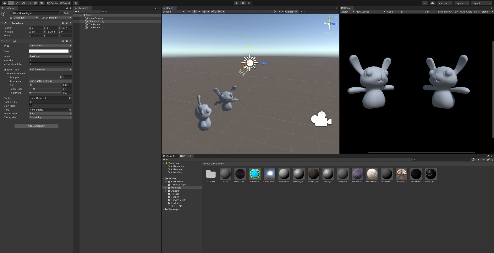
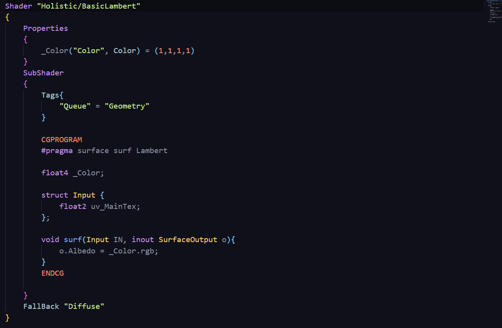
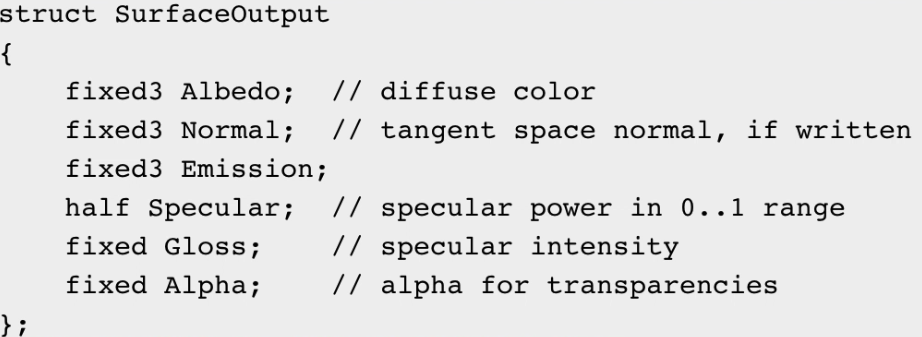
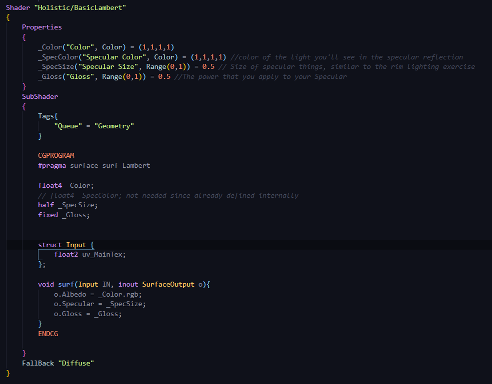
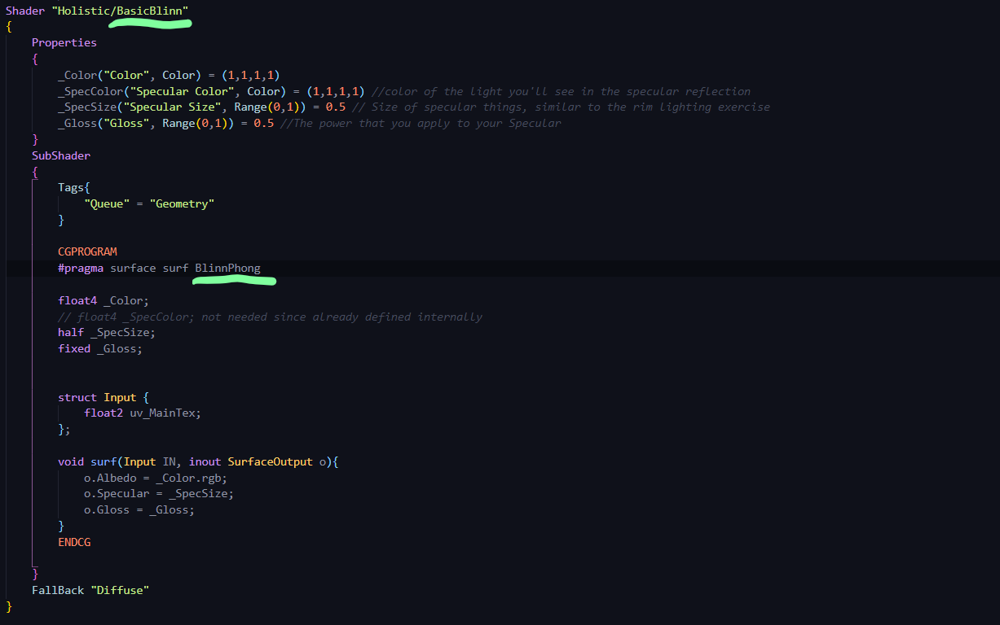
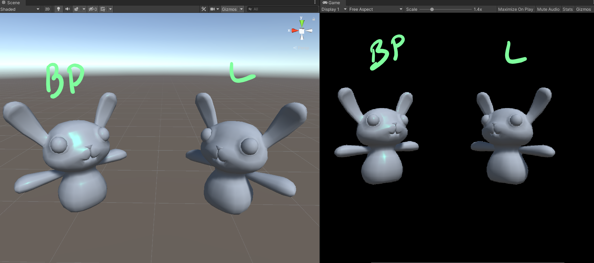

# DEV-15, Blinn-Phong Lighting & Surface Output
#### Tags: [lighting]

## What does Blinn-Phong do differently than Lambert?
    Blinn adds to the equation what Lambert can't...Specular Highlights and you can control these highlights with intensity and power values.

## Unity

    Current start:

## Adding lighting properties and applying them

    If you try messing with this in unity it wont work. Lambert does not support specular lighting

## Changing from Lambert to Blinn Phong

