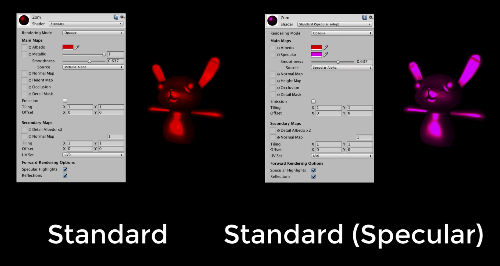
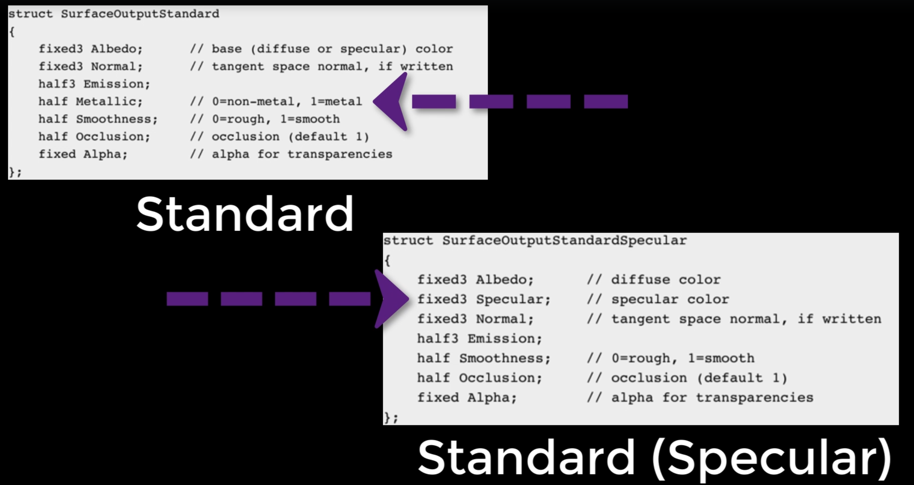
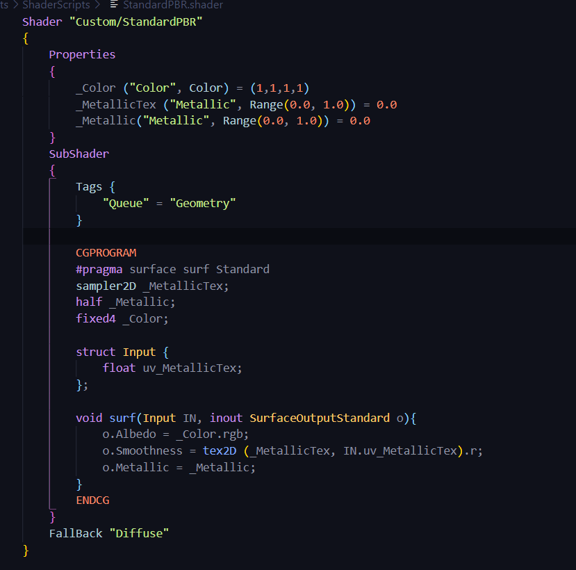

# DEV-16, Physically-Based Rendering
#### Tags: [PBR, redo]

## Two Shaders

    Unity includes 2 physically-based shaders. The Standard and the Standard Specular. The differences are similar to those between Lambert and BlinnPhong.

    However, each of these PBR shaders in Unity has its own output structure.

    We're bringing in a Color...a Metallic texture...
    and a Metallic Range value.

    Now this metallic texture isn't what you think, it's not a texture that is the color of some metallic.

    Instead, it's going to be a map that I use to figure out which parts of the model I want to be shiny

