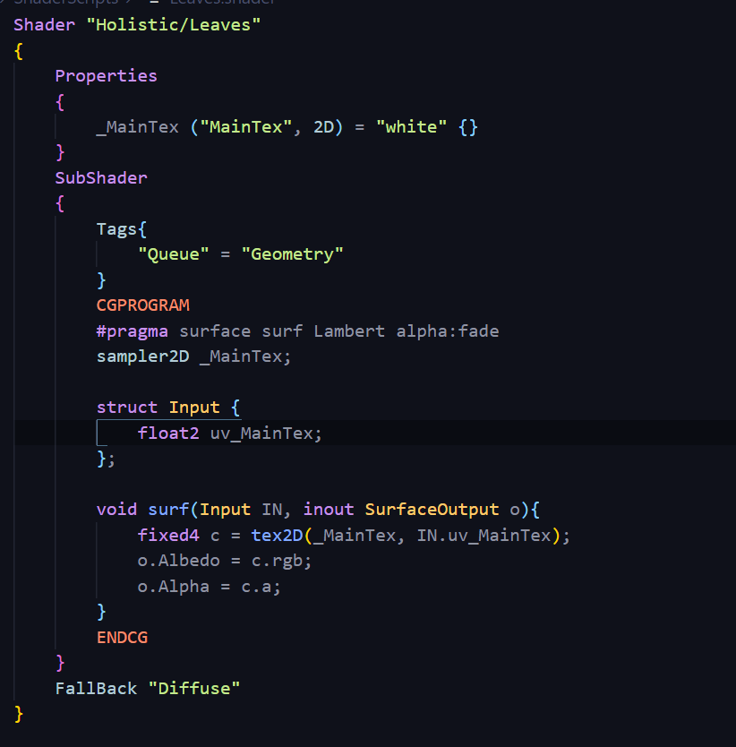

# DEV-17, The Alpha Channel
#### Tags: [alpha]

## What is the Alpha Channel?

    This is something I've already worked with in some of the shaders that I've developed,
    however the exact contribution of the alpha channel hasn't been fully explored. 
    

    
    The alpha channel is the 4th pixel value after the RGB in the color and represents how transparent that particular
    pixel is.

    This transparency is then used when compositing with several images. Basically, the alpha channel allows
    us to make objects transparent and see through.

## TGA vs PNG files

    Actually, there is a difference between PNG and TGA when it comes to reflections. TGA has better proportions when it comes to texture data for reflections. Replacing png with tga will give the materials better quality as far as reflections.

    https://docs.unity3d.com/Manual/HOWTO-alphamaps.html

## Make sure things are rendering properly

    Unity sorts items front-to-back in the Geometry queue to minimize overdraw, but sorts objects back-to-front in the Transparent queue to achieve the required visual effect. 

    this is how you apply it and make sure
    that it doesn't interrupt other geometry and other rendering.

