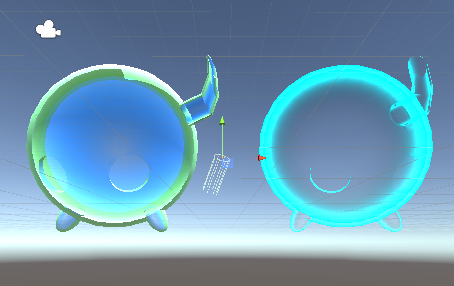

# DEV-18, Holograms
#### Tags: [Holograms]

## Model made in Blender

## Applying Stained glass and hologram material

    I noticed that I can see some geometry in the background through the hologram,
    some of this geometry is good but some of it I have no interest in seeing.

    Now this is happening because it's a transparent thing and there's no data written to the Z Buffer. So what I want to do is essentially write data to the Z Buffer before I put the holographic effect.

## How do I get rid of geometry that I do not want to see?

    I need to supply whats called a pass

    When I run one CGPROGRAM - ENDCG through the shader, it's 1 draw call, that is called a pass. You can do multiple passes in a shader. Of course, the more passes in the shader the more labor intensive the program is going to be rendering everything.

## The effect

    So let's just put in Pass...and inside that pass i'am going to perform 'ZWrite On'
    and I'm going to force it to write to the Z Buffer.
    and when  I write to the Z Buffer
    I don't want to be able to see anything.
    I just want depth data to go in there.
    So  I set the ColorMask to 0.
    When the second pass comes along, there'll be Z data in there for it to call on.
    So save that and then switch back and let's have a look how it affected the mesh.

    The code

