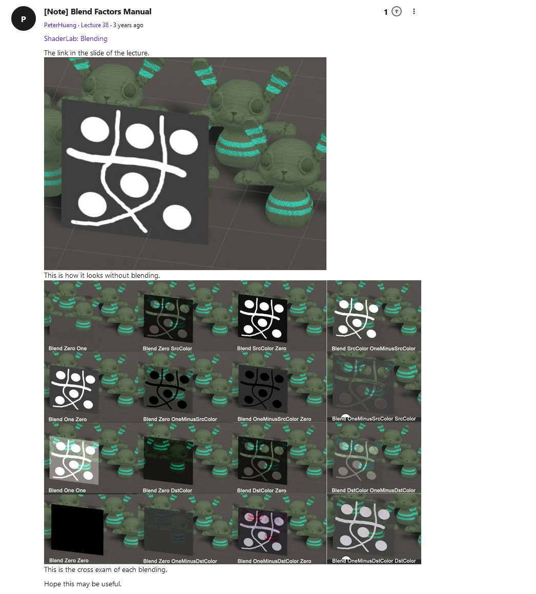
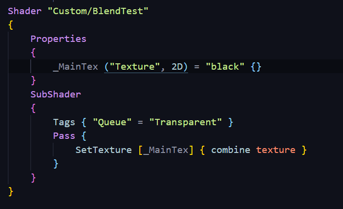
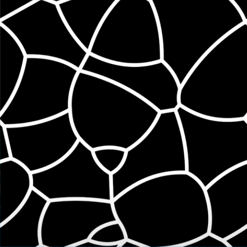
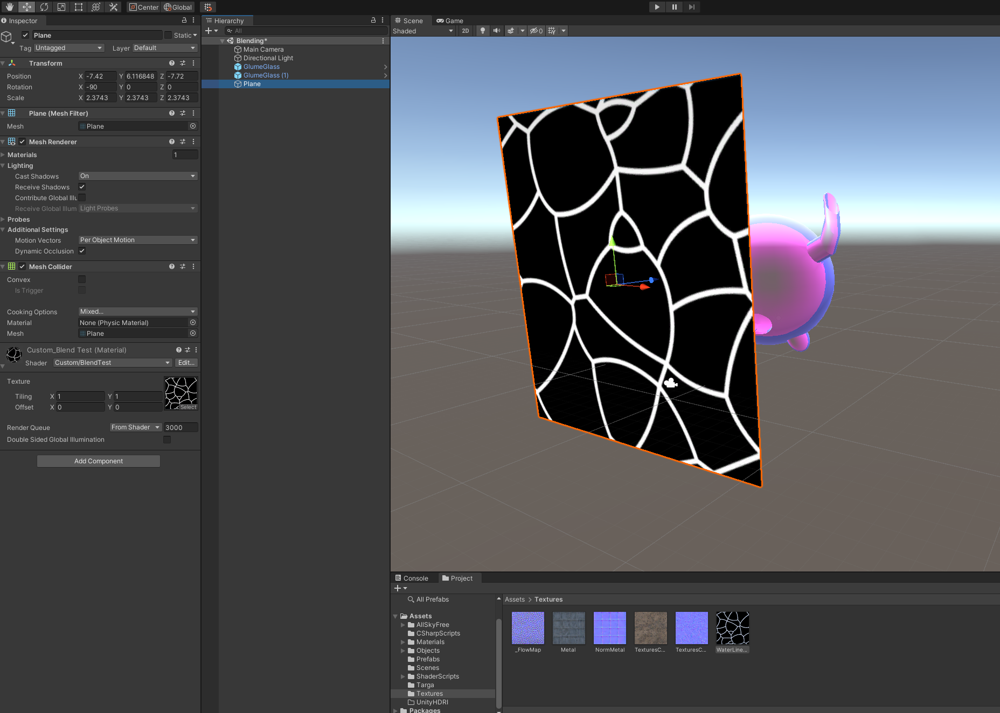
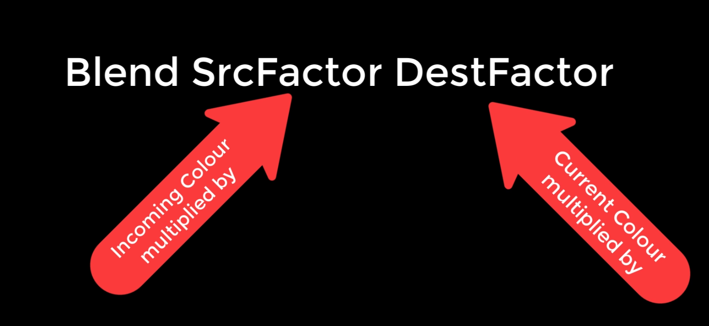
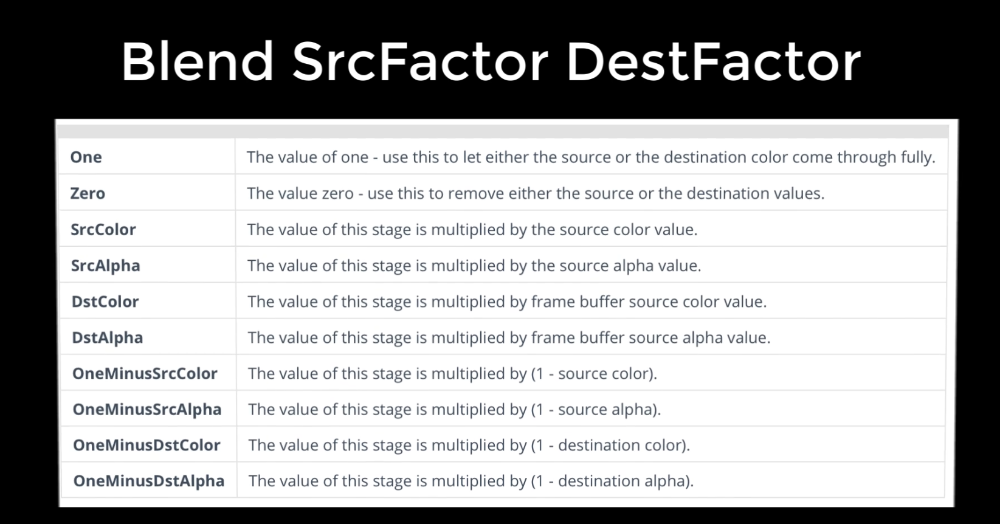
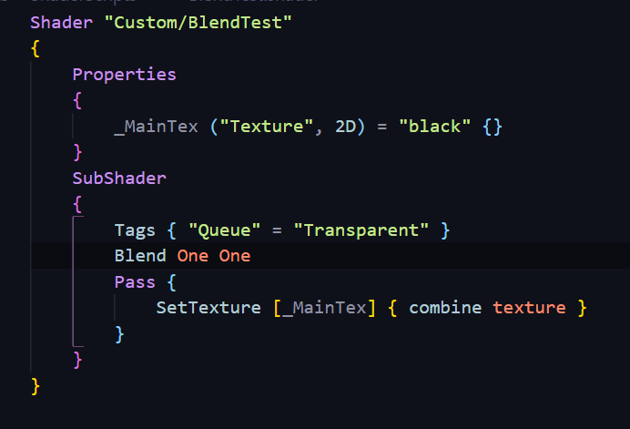
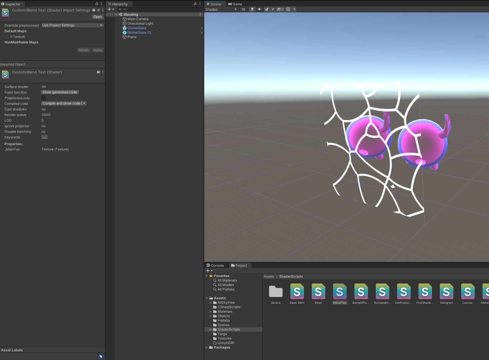
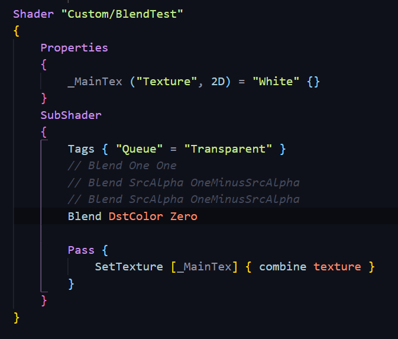
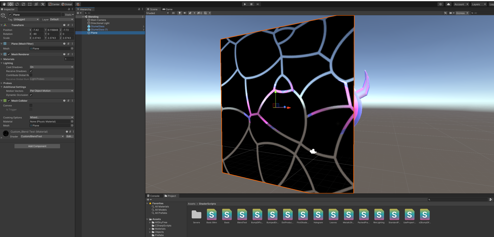

# DEV-19, Blending
#### Tags: [Blending, MeshEffects]

## Notes

    So this is a different way of making shaders and it's part of the ShaderLab code as well. 
    But overally I am leaving out the CG programming stuff.

    Now when we're talking about transparency, if you leave the texture out and you've got an object that's
    transparent and you combine it with something else then black will be fully transparent and you won't
    be able to see that object. If you put it to white,
    it will be fully opaque and therefore you'll get a white block on the screen.

## Texture

    Now we've only got one pass, but because it's not a CGPROGRAM which can exist without the little pass tag
    around it, you need to put it in. The command then is SetTexture using the main texture (_MainTex)
    and it's going to 'combine texture' and what this is doing is replacing the pixels in the frame buffer
    with whatever is in our texture. Now this is doing absolutely nothing any different than if you just created a stock standard quad and a very basic shader and slapped an image on it.

    Ok, so this is just doing that, but the magic's going to come in when we start doing our blends.
    So get that working.

## The Blend Command

    When you first put it in, the transparency is not going to show up. 
    That is controlled by an additional command, the Blend command.
    The blend command takes on a couple of formats, one of which looks like this.

    You can use the keyword 'blend' followed by a value that is to be multiplied with the INCOMING color
    and a value that is to be multiplied with the CURRENT color

    
## Result

    Now what this does is it multiplies one by the incoming color and then it multiplies what's already
    in the frame buffer (whatever is behind this quad) by the incoming color and then it adds them together.

## Result2

