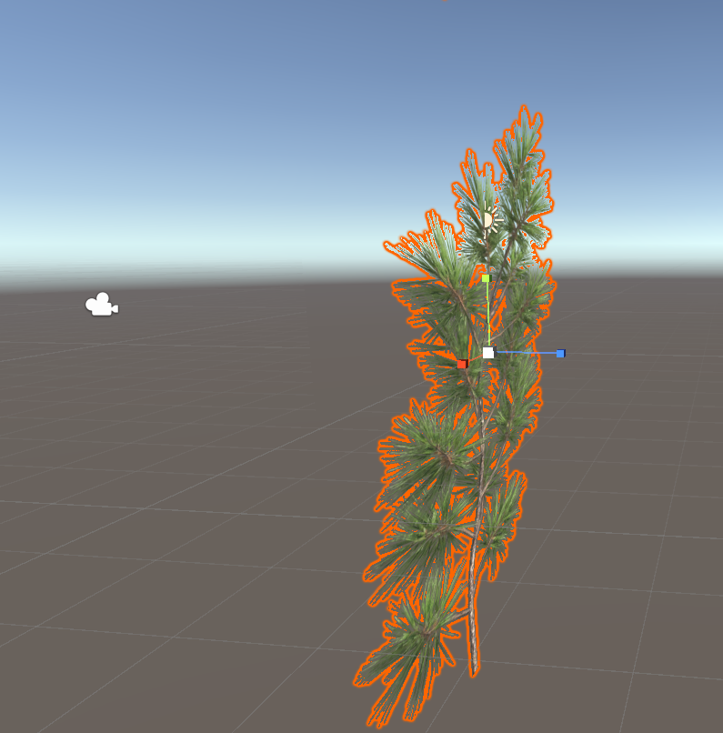

# DEV-20, BackFace Culling
#### Tags: [BackFace Culling]

## The problem

    Imagine a cube
    increase the size of the cube to the point that you are inside of it
    WHat happens is that you cann see from the inside out.

    So these sides of the cube (the other sides of the polygons that you can't see) are called the back face
    and the back face is 'culled' by default, in computer graphics because you're not looking at it and if
    you're not looking at it there's no point drawing it and rendering it because that's just extra processing.

    Where it does become a problem is when you've got a billboard or a flat surface that you want to be able to see
    from both sides and a very good example of this is trees.

