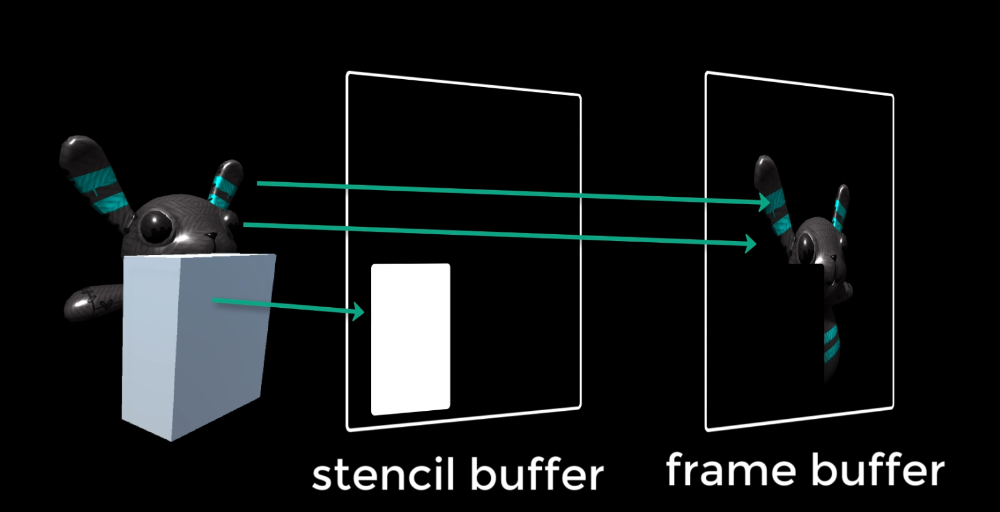
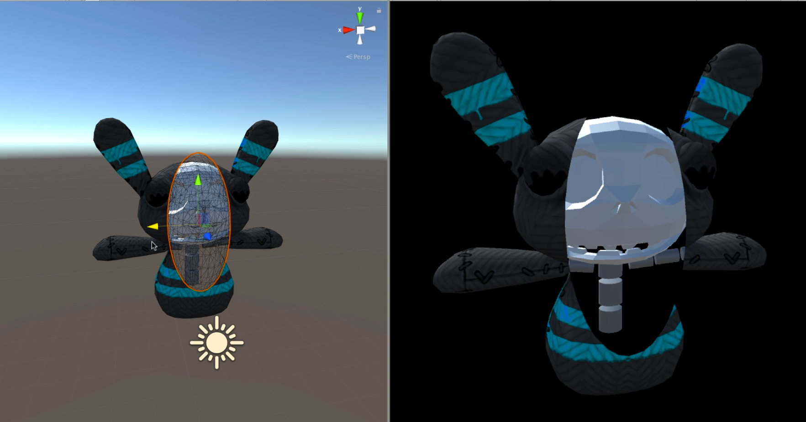
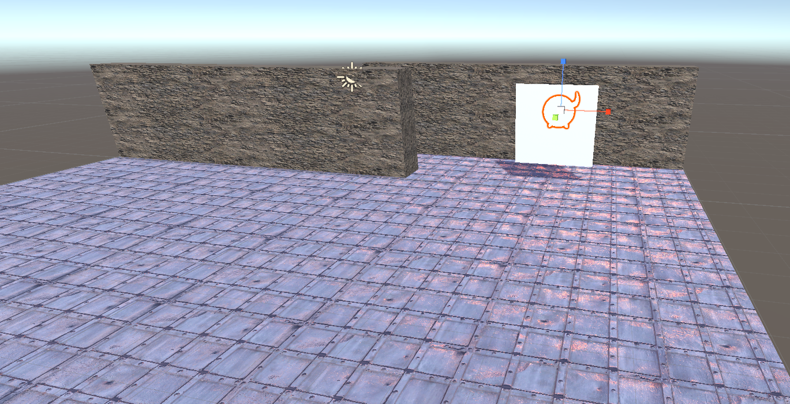
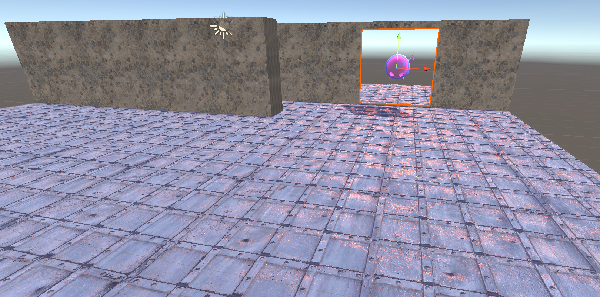
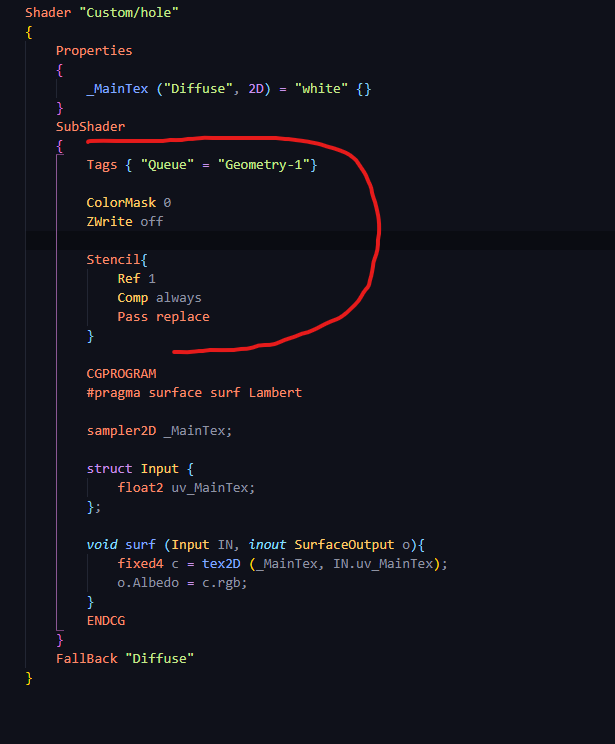
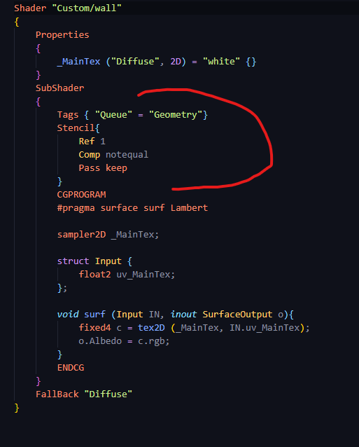
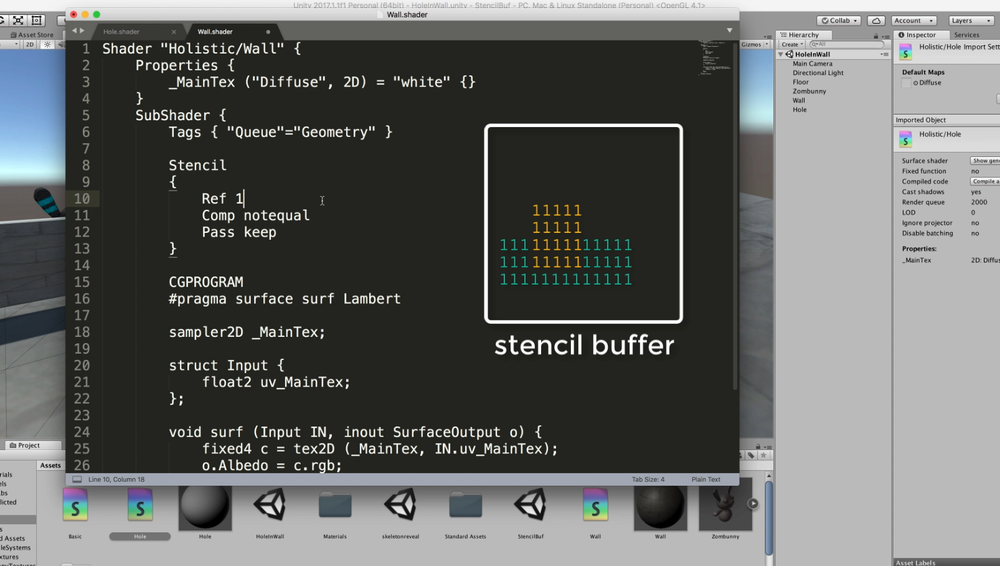

# DEV-22, Stencil Buffer
#### Tags: [Stencil Buffer]

## What in the world is the stencil buffer?

    The Stencil Buffer is a pixel mask
    that allows you further control of what pixels make it from the Scene into the frame buffer,
    kind of like the Z Buffer,
    but in this case, you can put all types of complicated masks into it which can prevent parts of objects
    from showing. 

    The object writing to the
    stencil buffer may, or may not be drawn depending on its purpose.

## Effect

    By keeping track of different numbers and swapping and change them in the Stenzel buffer you
    know when things have drawn and when things are masking other things out.

