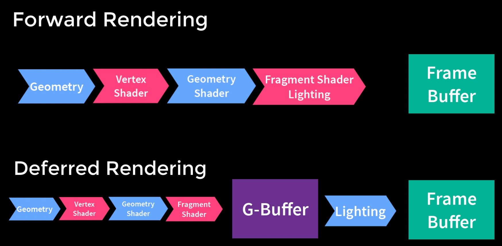
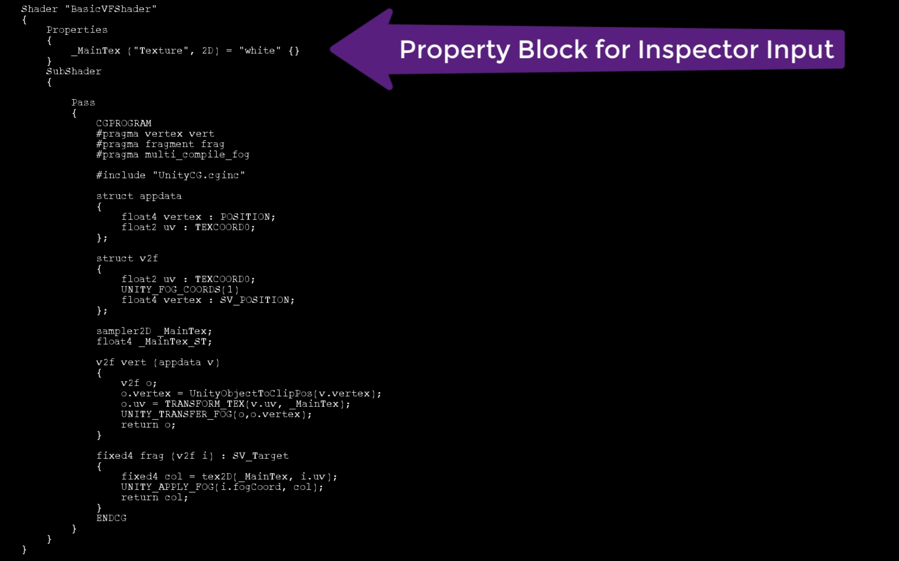
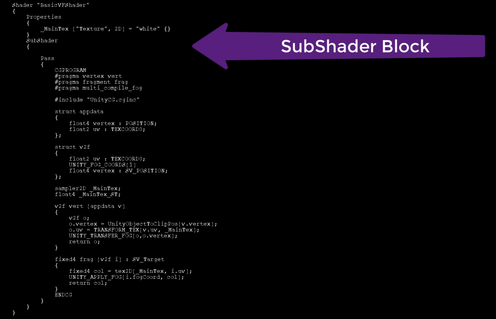
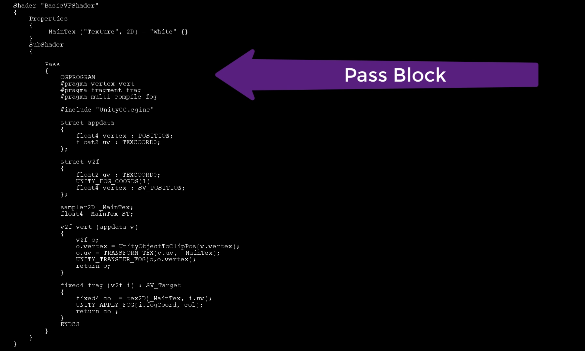
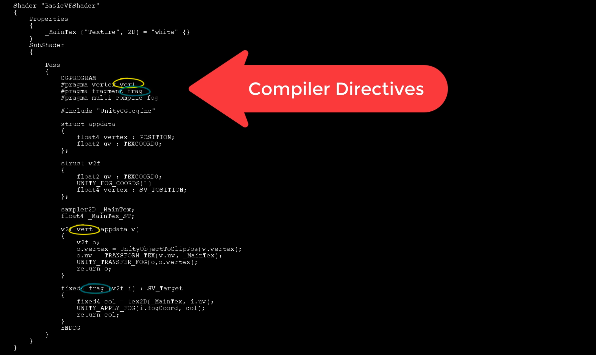
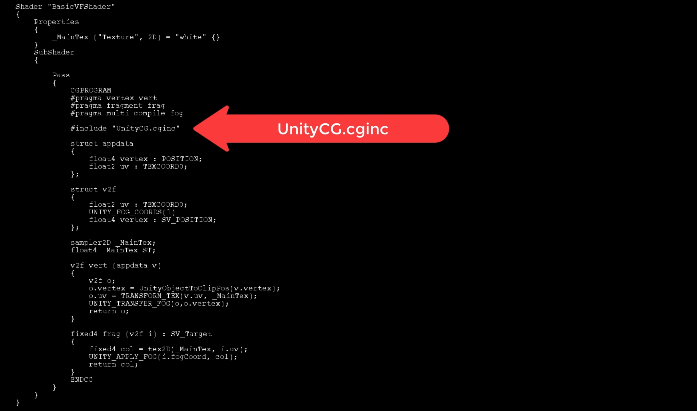
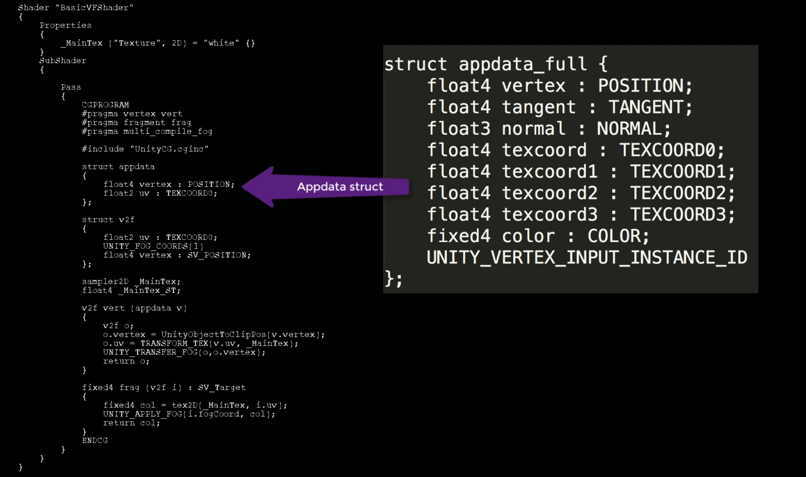
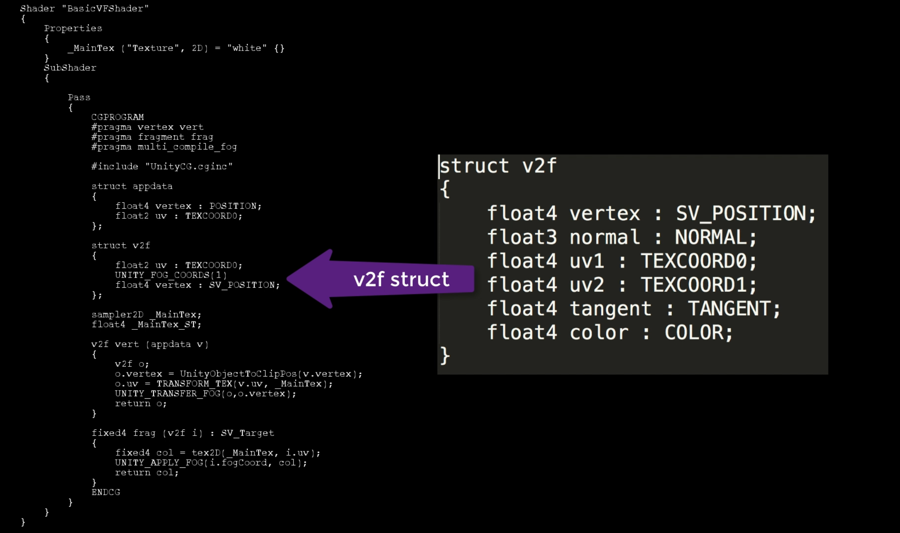
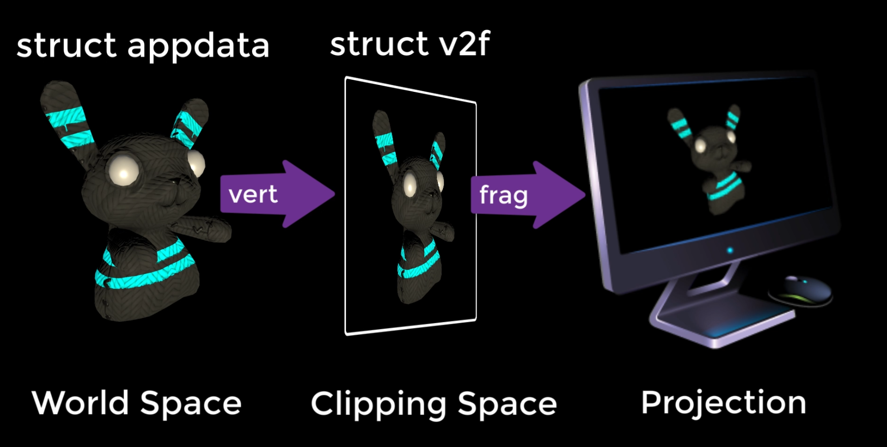
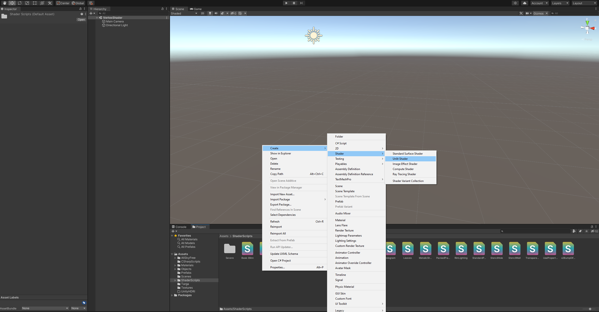

# DEV-23, The Anatomy of a Vertex Shader
#### Tags: [Vertex Shader]

## What is this?

    The Vertex and Fragment shaders
    give you a level of control over the shader that isn't available through the use of subsurface shaders
    alone. For example, so far we haven't been able to access or modify the vertices of a model with a shader,

## Forward Rendering vs Deferred Rendering

    https://gamedevelopment.tutsplus.com/articles/forward-rendering-vs-deferred-rendering--gamedev-12342

## Vertext Shader vs Fragment Shader

    The Vertex Shader gives us access to each vertex in the model
    where you can set its color or manipulate its position.

    The fragment shader provides per-pixel coloring, 
    but can also access pixels relative to world position

## Anatomy
    - Property Block for Inspector Input
    - Sub Shader Block
        - Pass Block
            - Compiler Directive Vertex
            - Compiler Directive Fragment
            - UnityCG.cginc
            - Struct for appdata
            - Struct for v2f

## Property Block for Inspector Input

## Sub Shader Block

## Pass Block

## Compiler Directive Vertex and Fragment

## UnityCG.cginc

    This file contains all the pre-written methods and variable definitions that will make your life writing
    shaders that much easier. It is usually called within a vertex Shader.

## Struct for appdata

    Appdata used by the vertex shader contains information about each vertex.
    You can also assign a color to each vertex, as well as get it's tangent

## Struct for v2f

    The v2fstruct is used by the Fragment Shader. Like the appdata structure,
    it can contain any (and all) properties that your fragment code requires and can be taken from this list.

    Note the way position is declared with SV_POSITION.
    This is because the vertex, after it has been transformed to screen space, has different coordinates,
    as opposed to the position used in the appdata and SV_POSITION will only be accepted by some graphics

## Pathway

    Start with a virtual object in 3D World Space. 
    The data about each and every vertex is stored in the appdata.
    This is processed by the vertex shader, 
    which projects the 3D data into the 2D clipping space and
    places values into the v2f struct. By the time the fragment shader runs,
    the scene has been what I like to call 'squashed' into the clipping space (or clipping plane)
    which is basically flattening all of the coordinates into 2D. From here,
    the fragment shader can calculate the color of each pixel that needs to appear in the final screen render.

## Creating a Vertex Shader

    You're looking for Unlit Shader.
    Remember, the vertex shaders take away all of the background processing that's done by the
    surface shaders that we've written in the past, so lighting and that kind of thing isn't handled.
    You have to write your very own code to handle lighting and shading for these types of shaders.
    So that's why it's called an Unlit Shader.