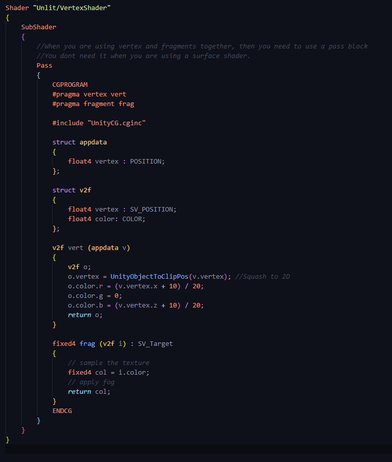

# DEV-24, Colouring by Vertices and Fragments
#### Tags: [vertex Shaders]

## Creating a Vertex Shader (Start)

    Now we're going to use the vertex position of the mesh to color the vertex of the mesh.
    Now you couldn't do this before with the surface shaders because you couldn't get access to the actual
    vertex data that was in the mesh. All you could really hope for was having UV values and normals and
    world positions and things like that, not absolute mesh positions.

## Working with world space

    X AND Z
    This runs on every vertex

## Working with screen space

    X AND Y
    This runs on every pixel

