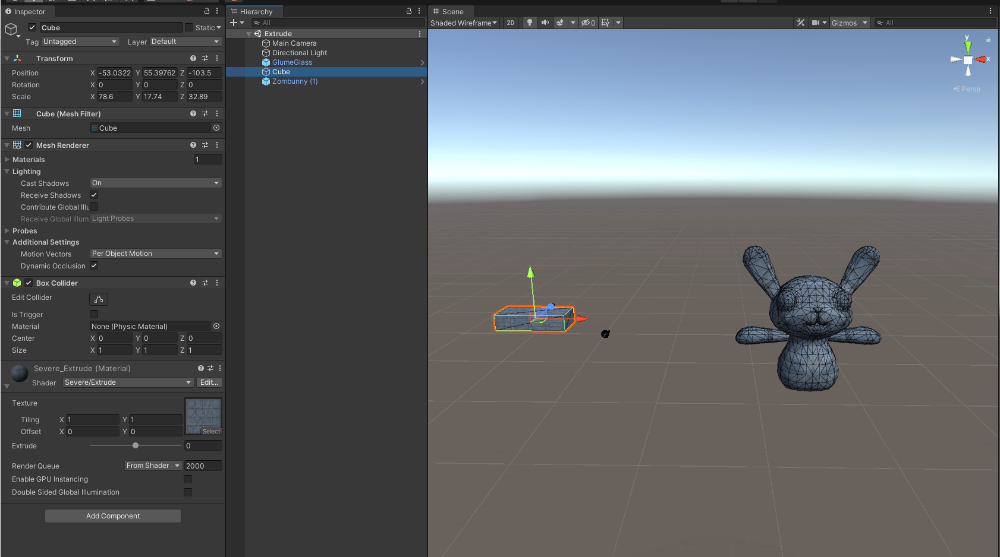
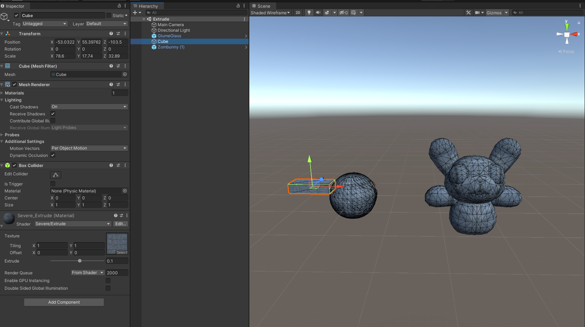

# DEV-28, Vertext Extruding
#### Tags: [moving verticies] 

## Combining vertex shaders and surface shaders

    So as we've seen, creating your own lighting effects in the vertex fragment shader is a BIG effort
    and you've already got the surface shader there that does all the lighting for you.
    So if you want to modify just the vertices and have some kind of vertex effect going on, you can combine
    THAT without the fragment part and just use the surface shader.

## Check for changes in Git